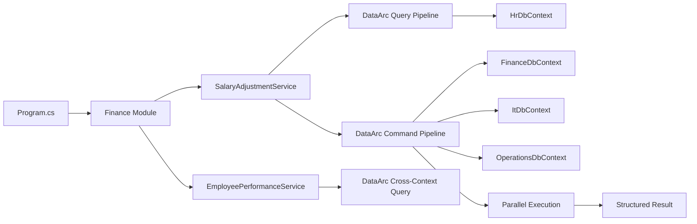
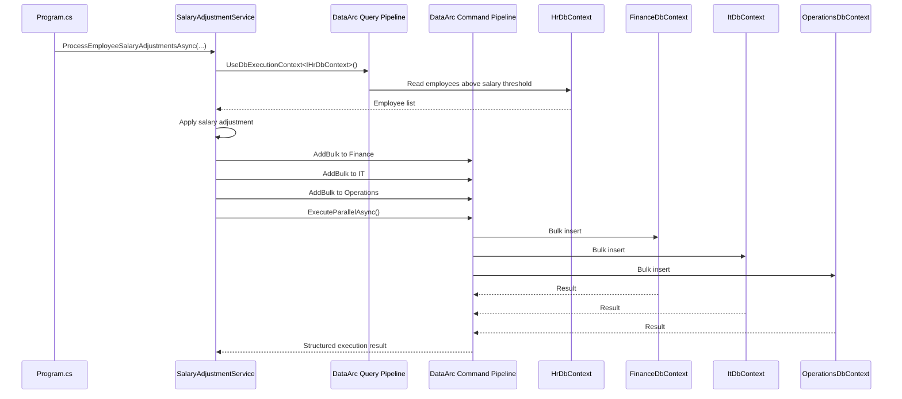
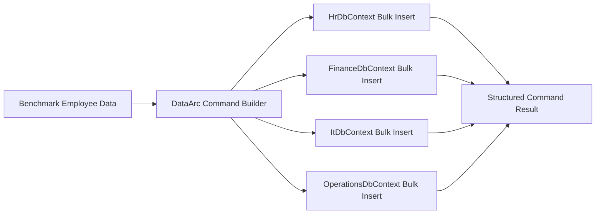
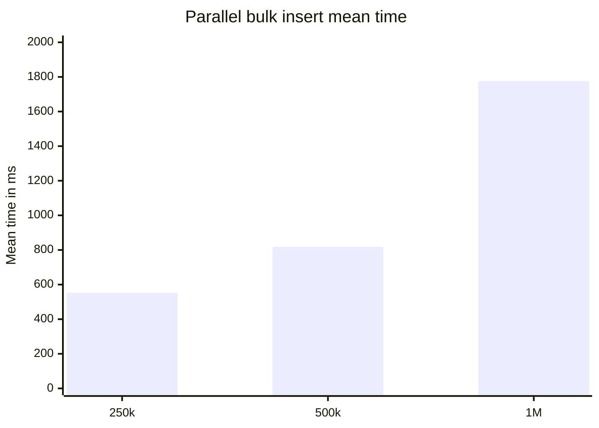
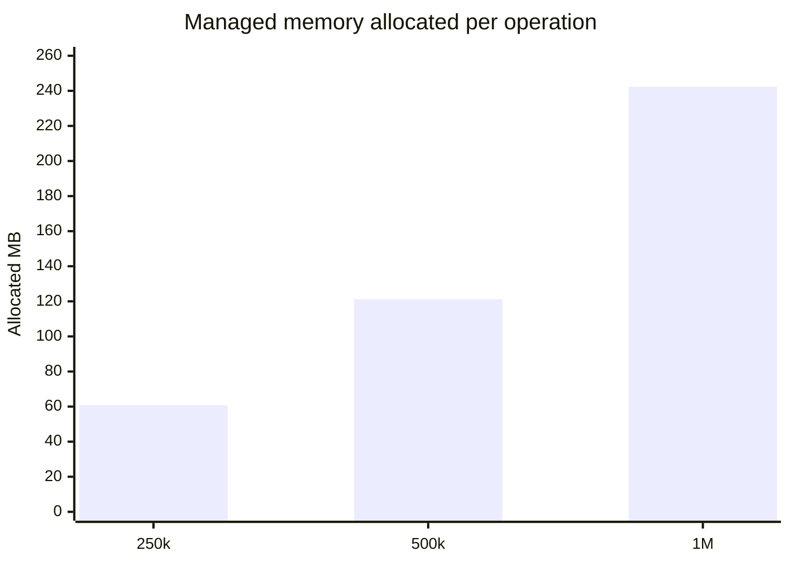
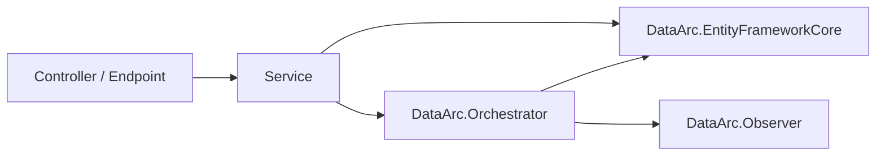

# DataArc.EntityFrameworkCore Demo

> EF Core for modular systems that need explicit execution, isolated `DbContext` boundaries, bulk operations, and cross-context workflows.

This repository demonstrates **DataArc.EntityFrameworkCore** inside a small modular .NET application.

The goal is adoption first: the demo starts with familiar EF Core concepts, then shows where DataArc adds value.

DataArc does not replace EF Core. It gives EF Core a deterministic execution layer for workflows that need to move beyond one direct `DbContext` call.

---

## Start Here

Recommended reading order:

1. `Program.cs`
2. `Application/Modules/Finance/Registration/FinanceModuleRegistration.cs`
3. `Application/Modules/Finance/Features/SalaryAdjustments/Services/SalaryAdjustmentService.cs`
4. `Application/Modules/Finance/Features/EmployeePerformance/Services/EmployeePerformanceService.cs`
5. `Persistence/PersistenceRegistration.cs`
6. `Persistence/Database/Creator`
7. `Persistence/Database/DbContexts`
8. `DataArc.EntityFrameworkCore.Demo.Benchmark`

---

## What This Demo Proves

The demo uses four isolated EF Core persistence boundaries:

- `HrDbContext`
- `FinanceDbContext`
- `ItDbContext`
- `OperationsDbContext`

The application workflow:

1. Creates the demo databases.
2. Generates SQL scripts for the database operations.
3. Seeds employee data into HR.
4. Reads employees from HR.
5. Applies a salary adjustment.
6. Bulk writes adjusted data into Finance, IT, and Operations.
7. Executes the command pipeline in parallel.
8. Queries top-rated employees across all four contexts.
9. Prints a short summary.



The central idea:

```text
Keep EF Core.
Keep DbContexts isolated.
Choose the execution boundary explicitly.
Build a command or query pipeline.
Execute the workflow.
Receive a structured result.
```

---

## Why DataArc.EntityFrameworkCore Exists

EF Core is excellent inside one `DbContext`.

Real systems often need workflows across persistence boundaries:

- identity + licensing
- products + packaging
- pricing + entitlements
- audit + activations
- HR + finance + operations
- modular monolith modules sharing one database
- scheduled workloads that touch multiple bounded contexts

DataArc gives these workflows a C# execution model without forcing one giant `DbContext`, repository-per-table coordination, or handler-per-small-query sprawl.

DataArc is useful when you need:

- modular EF Core context boundaries
- command/query separation
- bulk operations
- cross-context workflows
- parallel execution
- structured execution results
- transaction-aware command flows
- logging-friendly outcomes
- high-volume scheduled jobs
- cross-context read models

---

## Project Structure

```text
DataArc.EntityFrameworkCore.Demo
│
├── Application
│   └── Modules
│       └── Finance
│           ├── Features
│           │   ├── SalaryAdjustments
│           │   │   ├── Dtos
│           │   │   │   └── EmployeeDto.cs
│           │   │   └── Services
│           │   │       ├── ISalaryAdjustmentService.cs
│           │   │       └── SalaryAdjustmentService.cs
│           │   └── EmployeePerformance
│           │       └── Services
│           │           ├── IEmployeePerformanceService.cs
│           │           └── EmployeePerformanceService.cs
│           └── Registration
│               └── FinanceModuleRegistration.cs
│
├── Persistence
│   ├── Database
│   │   ├── Creator
│   │   │   ├── FinanceDbCreator.cs
│   │   │   ├── HrDbCreator.cs
│   │   │   ├── ItDbCreator.cs
│   │   │   └── OperationsDbCreator.cs
│   │   ├── DbContexts
│   │   │   ├── FinanceDbContext.cs
│   │   │   ├── HrDbContext.cs
│   │   │   ├── ItDbContext.cs
│   │   │   └── OperationsDbContext.cs
│   │   ├── DbModels
│   │   │   ├── Employee.cs
│   │   │   └── Employer.cs
│   │   └── Seeder
│   │       ├── HrDbSeeder.cs
│   │       └── SeedDataGenerator.cs
│   └── PersistenceRegistration.cs
│
└── Program.cs
```

The application module owns the use cases.

The persistence layer owns EF Core contexts, database models, database creation, seeding, and DataArc execution context registration.

---

## Internal DbContexts, Public Execution Boundaries

The demo keeps concrete EF Core `DbContext` implementations internal to the persistence project.

Application code does not depend directly on `FinanceDbContext`, `HrDbContext`, `ItDbContext`, or `OperationsDbContext`.

Instead, each context is exposed through a small public execution-context interface:

```csharp
public interface IFinanceDbContext : IExecutionContext<FinanceDbContext>
{
}
```

The concrete context can remain internal:

```csharp
internal class FinanceDbContext : DbContext, IFinanceDbContext
{
    public FinanceDbContext(DbContextOptions<FinanceDbContext> options)
        : base(options)
    {
    }

    public DbSet<Employer> Employer { get; set; }

    public DbSet<Employee> Employee { get; set; }
}
```

Application services route work through the execution boundary:

```csharp
commandBuilder
    .UseDbExecutionContext<IFinanceDbContext>()
        .AddBulk(employees, batchSize);
```

This keeps persistence implementation details inside the persistence layer while giving application code explicit control over where work executes.

---

## DataArc Registration

Each EF Core context is registered as a DataArc database execution context.

```csharp
services.AddDataArcCore();

services.ConfigureDataArc(dataArc =>
{
    dataArc.UseEntityFrameworkCore(ef =>
    {
        ef.AddDbExecutionContext<IFinanceDbContext, FinanceDbContext>(options =>
            options.UseSqlServer(financeConnectionString));

        ef.AddDbExecutionContext<IHrDbContext, HrDbContext>(options =>
            options.UseSqlServer(hrConnectionString));

        ef.AddDbExecutionContext<IItDbContext, ItDbContext>(options =>
            options.UseSqlServer(itConnectionString));

        ef.AddDbExecutionContext<IOperationsDbContext, OperationsDbContext>(options =>
            options.UseSqlServer(operationsConnectionString));
    });
});
```

The registration tells DataArc:

```text
This interface is the execution boundary.
This concrete DbContext is the EF Core implementation.
This connection string points to the target database.
```

---

## Database Creation Without EF Core Migration Files

The demo does not use EF Core migration files.

Each database has its own familiar creator:

```text
FinanceDbCreator
HrDbCreator
ItDbCreator
OperationsDbCreator
```

Each creator implements EF Core's `IDatabaseCreator` shape and uses DataArc's database builder to create its database from the current `DbContext` model.

Example:

```csharp
public class FinanceDbCreator : IFinanceDbCreator
{
    private readonly IDatabaseFactory _databaseFactory;

    public FinanceDbCreator(IDatabaseFactory databaseFactory)
    {
        _databaseFactory = databaseFactory;
    }

    public bool EnsureCreated()
    {
        var dbBuilder = _databaseFactory.CreateDatabaseBuilder();

        var db = dbBuilder
            .IncludeDbContext<FinanceDbContext>()
            .Build(generateScripts: true, applyChanges: true);

        db.ExecuteCreate();

        return true;
    }

    public bool EnsureDeleted()
    {
        var dbBuilder = _databaseFactory.CreateDatabaseBuilder();

        var db = dbBuilder
            .IncludeDbContext<FinanceDbContext>()
            .Build(generateScripts: true, applyChanges: true);

        db.ExecuteDrop();

        return true;
    }
}
```

EF Core's `EnsureCreated()` can create a database from a model. DataArc's builder adds reviewable script generation without requiring EF Core migration files in this demo.

Generated SQL scripts are written to the app output directory under `Scripts`.

Example:

```text
bin/Debug/net8.0/Scripts
```

The generated scripts include database creation, schema creation, table creation, and constraints.

```sql
CREATE DATABASE [FinanceDb];
GO

USE [FinanceDb];
GO

IF SCHEMA_ID('employees') IS NULL EXEC('CREATE SCHEMA [employees]');
GO

CREATE TABLE [employees].[Employees] (
    [Id] int IDENTITY(1,1) NOT NULL,
    [EmployeeName] varchar(50) NULL,
    [EmployeeSalary] decimal(33,2) NOT NULL,
    PRIMARY KEY ([Id])
);
GO
```

This is a supporting setup capability. The main demo value is still the command/query execution model.

---

## Program Flow

`Program.cs` keeps the demo path direct:

```csharp
var serviceProvider = new ServiceCollection()
    .AddFinanceModule()
    .BuildServiceProvider();

var databaseCreators = new IDatabaseCreator[]
{
    serviceProvider.GetRequiredService<IFinanceDbCreator>(),
    serviceProvider.GetRequiredService<IHrDbCreator>(),
    serviceProvider.GetRequiredService<IItDbCreator>(),
    serviceProvider.GetRequiredService<IOperationsDbCreator>()
};

var databaseSeeders = new IDatabaseSeeder[]
{
    serviceProvider.GetRequiredService<IHrDbSeeder>()
};

await ResetDatabasesAsync(databaseCreators, databaseSeeders, batchSize);
```

Only HR is seeded because the workflow starts from HR and writes adjusted data into Finance, IT, and Operations.

---

## Salary Adjustment Use Case

`SalaryAdjustmentService` reads employees from HR, applies a salary adjustment, then writes adjusted employee data into Finance, IT, and Operations.



Core code shape:

```csharp
var employeesQuery = await _queryFactory.CreateQueryAsync();

var employees = await employeesQuery
    .UseDbExecutionContext<IHrDbContext>()
        .ReadWhereAsync<Employee>(employee => employee.Salary > salaryThreshold);

foreach (var employee in employees)
{
    employee.Salary += employee.Salary * salaryAdjustmentBaseRate;
}

var commandBuilder = await _commandFactory.CreateCommandBuilderAsync();

commandBuilder
    .UseDbExecutionContext<IFinanceDbContext>()
        .AddBulk(employees, batchSize);

commandBuilder
    .UseDbExecutionContext<IItDbContext>()
        .AddBulk(employees, batchSize);

commandBuilder
    .UseDbExecutionContext<IOperationsDbContext>()
        .AddBulk(employees, batchSize);

var command = await commandBuilder.BuildAsync();
var commandResult = await command.ExecuteParallelAsync();

if (!commandResult.Success)
{
    throw new InvalidOperationException(
        $"Failed to process salary adjustments. {commandResult.Exception?.Message}");
}

return commandResult.TotalAffected;
```

The service reads from one context and writes to three others through one command pipeline.

---

## Employee Performance Query

`EmployeePerformanceService` demonstrates a cross-context read model.

It starts from HR employees above a rating threshold, joins matching employees across Finance, IT, and Operations, then projects into a DTO.

```csharp
var topRatedEmployeesQuery = await _queryFactory.CreateQueryAsync();

var topRatedEmployees = await topRatedEmployeesQuery
    .UseDbExecutionContext<IHrDbContext, Employee>(employee => employee.Rating > rating)
        .Join<IFinanceDbContext, Employee>(
            bag => bag.Get<Employee>()!.Id,
            financeEmployee => financeEmployee.Id)
        .Join<IItDbContext, Employee>(
            bag => bag.Get<Employee>()!.Id,
            itEmployee => itEmployee.Id)
        .Join<IOperationsDbContext, Employee>(
            bag => bag.Get<Employee>()!.Id,
            operationsEmployee => operationsEmployee.Id)
    .Select(bag => new EmployeeDto
    {
        Id = bag.Get<Employee>()!.Id,
        Name = bag.Get<Employee>()!.Name!,
        Surname = bag.Get<Employee>()!.Surname!,
        Salary = bag.Get<Employee>()!.Salary!
    })
    .ToListAsync();
```

This shows the read side of the same idea:

```text
Multiple isolated contexts.
One explicit read model.
One application feature.
```

---

## Benchmark

The benchmark measures DataArc parallel bulk insert execution across four EF Core persistence boundaries:

- `HrDbContext`
- `FinanceDbContext`
- `ItDbContext`
- `OperationsDbContext`

Each benchmark case inserts `RecordCount` employees into each participating context.

```text
Total inserted records = RecordCount x 4
```

Default benchmark shape:

```csharp
[Params(62_500, 125_000, 250_000)]
public int RecordCount { get; set; }

[Params(62_500)]
public int BulkBatchSize { get; set; }
```

Execution shape:

```csharp
var commandBuilder = await _commandFactory.CreateCommandBuilderAsync();

commandBuilder
    .UseDbExecutionContext<IHrDbContext>()
        .AddBulk(_benchmarkEmployees, BulkBatchSize);

commandBuilder
    .UseDbExecutionContext<IFinanceDbContext>()
        .AddBulk(_benchmarkEmployees, BulkBatchSize);

commandBuilder
    .UseDbExecutionContext<IItDbContext>()
        .AddBulk(_benchmarkEmployees, BulkBatchSize);

commandBuilder
    .UseDbExecutionContext<IOperationsDbContext>()
        .AddBulk(_benchmarkEmployees, BulkBatchSize);

var command = await commandBuilder.BuildAsync();
var commandResult = await command.ExecuteParallelAsync();
```



### Benchmark Environment

```text
BenchmarkDotNet v0.15.8
OS: Windows 11 25H2 / 2025 Update
CPU: 13th Gen Intel Core i7-13700H 2.40GHz
Cores: 14 physical, 20 logical
.NET SDK: 10.0.300
Runtime: .NET 8.0.27
JIT: RyuJIT x64
InvocationCount: 1
IterationCount: 10
WarmupCount: 1
UnrollFactor: 1
Diagnosers: MemoryDiagnoser, ThreadingDiagnoser
```

### Benchmark Results

| Method | Record Count Per Context | Bulk Batch Size | Total Inserted Records | Mean | StdDev | Completed Work Items | Lock Contentions | Gen0 | Allocated |
|---|---:|---:|---:|---:|---:|---:|---:|---:|---:|
| ExecuteParallelBulkInsertAsync | 62,500 | 62,500 | 250,000 | 552.2 ms | 84.94 ms | 19,309 | - | 5,000 | 60.83 MB |
| ExecuteParallelBulkInsertAsync | 125,000 | 62,500 | 500,000 | 818.4 ms | 90.35 ms | 38,614 | - | 10,000 | 121.19 MB |
| ExecuteParallelBulkInsertAsync | 250,000 | 62,500 | 1,000,000 | 1,775.7 ms | 344.70 ms | 77,974 | - | 20,000 | 242.31 MB |

### Benchmark Trend





### Benchmark Notes

These results are workload-specific evidence, not a universal performance guarantee.

Results depend on:

- hardware
- database provider
- database location
- schema shape
- entity size
- indexes
- batch size
- relationship graph complexity
- runtime version
- database state before each iteration
- transaction behavior

The useful engineering signal is not only elapsed time. The benchmark runs through a single explicit command pipeline across four context boundaries, with structured success/failure reporting and no reported lock contentions in this run.

---

## Why Add DataArc.EntityFrameworkCore To Your Engineering Toolkit?

### 1. Preserve Modular EF Core Boundaries

Many systems use one normalized database while still needing separate logical EF Core boundaries.

```text
IdentityContext
ProductsContext
PackagingContext
LicensingContext
PricingContext
AuditContext
```

DataArc lets teams preserve modular context boundaries without collapsing every model into one giant `DbContext`.

### 2. Give Cross-Context Workflows An Execution Model

Real workflows often need data from multiple persistence boundaries.

DataArc gives those workflows a C# execution model across contexts.

```text
Read from one boundary.
Write to another.
Join across multiple boundaries.
Return a structured result.
```

### 3. Coordinate Parallel Operations

EF Core can run multiple `DbContext` instances in parallel when each path has its own context instance and lifecycle.

DataArc turns the coordination into a command pipeline:

```csharp
var commandBuilder = await _commandFactory.CreateCommandBuilderAsync();

commandBuilder
    .UseDbExecutionContext<IFinanceDbContext>()
        .AddBulk(financeEmployees, batchSize);

commandBuilder
    .UseDbExecutionContext<IItDbContext>()
        .AddBulk(itEmployees, batchSize);

commandBuilder
    .UseDbExecutionContext<IOperationsDbContext>()
        .AddBulk(operationsEmployees, batchSize);

var command = await commandBuilder.BuildAsync();
var result = await command.ExecuteParallelAsync();
```

### 4. Reduce Repository And Handler Coordination Sprawl

Repositories, handlers, and CQRS request classes can be useful.

The pain starts when every small data access variation becomes a new repository method, query class, command class, handler, and orchestration point.

DataArc gives teams another option: compose against known EF Core execution boundaries through query and command builders.

```text
DbContexts are persistence boundaries.
DataArc is the execution layer.
Orchestrators are workflow boundaries.
```

### 5. Build Cross-Context Read Models

DataArc supports cross-context read model composition using a bag pattern.

Each join adds data to the bag. The final projection creates a workflow-specific read model.

```csharp
var rows = await query
    .UseDbExecutionContext<IIntersectionContext, UserProduct>(
        userProduct => userProduct.UserId == userId)
    .Join<IProductsContext, Product>(
        bag => bag.Get<UserProduct>()!.ProductId,
        product => product.Id)
    .Join<IPackagingContext, Package>(
        bag => bag.Get<Product>()!.PackageId,
        package => package.Id)
    .Select(bag => new ProductPackageRow
    {
        ProductName = bag.Get<Product>()!.Name,
        PackageName = bag.Get<Package>()!.Name
    })
    .ToListAsync();
```

### 6. Support High-Volume Scheduled Workloads

Many systems run large data operations on a schedule:

```text
Month-end billing
Year-end processing
License renewals
Entitlement recalculation
Product imports
Customer migrations
Reconciliation jobs
Audit/archive jobs
Tenant provisioning
Reporting snapshots
```

These jobs affect memory, CPU, database load, deployment sizing, and cost.

DataArc is built for those moments.

---

## When To Use Direct DbContext

Use `DbContext` directly when the operation is simple and stays inside one persistence boundary.

```csharp
dbContext.Set<Employee>().Add(employee);
await dbContext.SaveChangesAsync();
```

Use DataArc.EntityFrameworkCore when the workflow needs:

- multiple contexts
- bulk operations
- parallel execution
- structured execution results
- context switching
- cross-context read models
- transaction-aware command flows
- logging and performance visibility

```text
DbContext is excellent inside one persistence boundary.
DataArc coordinates execution across boundaries.
```

---

## Where Orchestrators Fit

DataArc.EntityFrameworkCore can be used directly in services, as this demo shows.

When workflows become larger, move the workflow into **DataArc.Orchestrator**.

For post-execution outcomes, use **DataArc.Observer**.



---

## Running The Demo

### 1. Configure Connection Strings

Update the SQL Server connection strings in `PersistenceRegistration.cs`.

```csharp
var financeConnectionString =
    "Server=YOUR_SERVER;Database=FinanceDb;Integrated Security=true;TrustServerCertificate=True;";

var hrConnectionString =
    "Server=YOUR_SERVER;Database=HrDb;Integrated Security=true;TrustServerCertificate=True;";

var itConnectionString =
    "Server=YOUR_SERVER;Database=ItDb;Integrated Security=true;TrustServerCertificate=True;";

var operationsConnectionString =
    "Server=YOUR_SERVER;Database=OperationsDb;Integrated Security=true;TrustServerCertificate=True;";
```

### 2. Run The Application

The demo multi-targets .NET 6, 7, 8, 9, and 10.

Example:

```bash
dotnet run --framework net8.0
```

The application will:

1. Delete existing demo databases.
2. Create demo databases.
3. Generate SQL scripts under the app output `Scripts` folder.
4. Seed HR employee data.
5. Run the salary adjustment workflow.
6. Bulk distribute adjusted employee data into Finance, IT, and Operations.
7. Query top-rated employee details.
8. Print a summary.

Expected summary shape:

```text
Databases deleted successfully.
Databases created successfully.
Databases seeded successfully.
Processed salary adjustment records: 300,000

Top Rated Employee: Name12345 Surname12345, Salary: 151,234.56, Number of top rated employees: 1,234

Press any key to exit.
```

---

## Running The Benchmark

From the benchmark project:

```bash
dotnet run -c Release --framework net8.0
```

BenchmarkDotNet will generate detailed output under the benchmark artifacts folder.

---

## Trial Path

DataArc.EntityFrameworkCore supports a 14-day trial so teams can test real workloads before purchasing.

Use the trial to validate:

- modular context boundaries
- cross-context queries
- command pipelines
- bulk operations
- scheduled workload behavior
- logging and execution reporting

---

## Summary

DataArc.EntityFrameworkCore gives EF Core a deterministic execution layer for modular, high-throughput, multi-context systems.

It helps teams:

- keep concrete `DbContext` implementations internal
- expose public execution-context interfaces
- preserve modular context boundaries
- create databases and generate scripts without EF Core migration files in this demo path
- compose cross-context workflows
- execute coordinated command pipelines
- run parallel operations
- reduce repository and handler coordination sprawl
- build cross-context read models
- run bulk workloads with controlled memory behavior
- return structured execution results
- log and measure workflow execution

Most architectures define structure.

**DataArc controls execution.**
