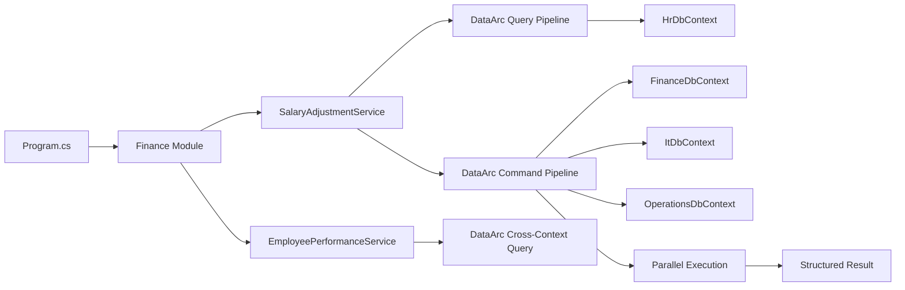
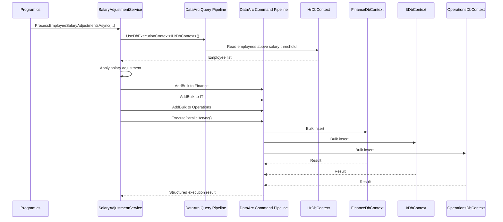
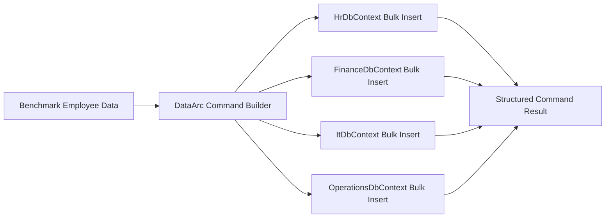
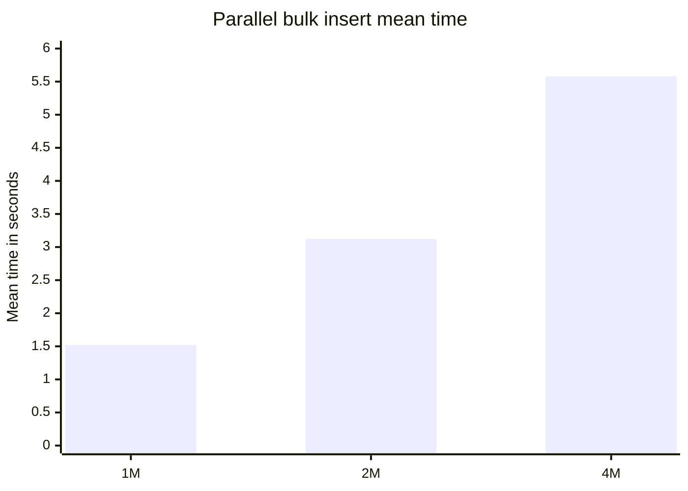
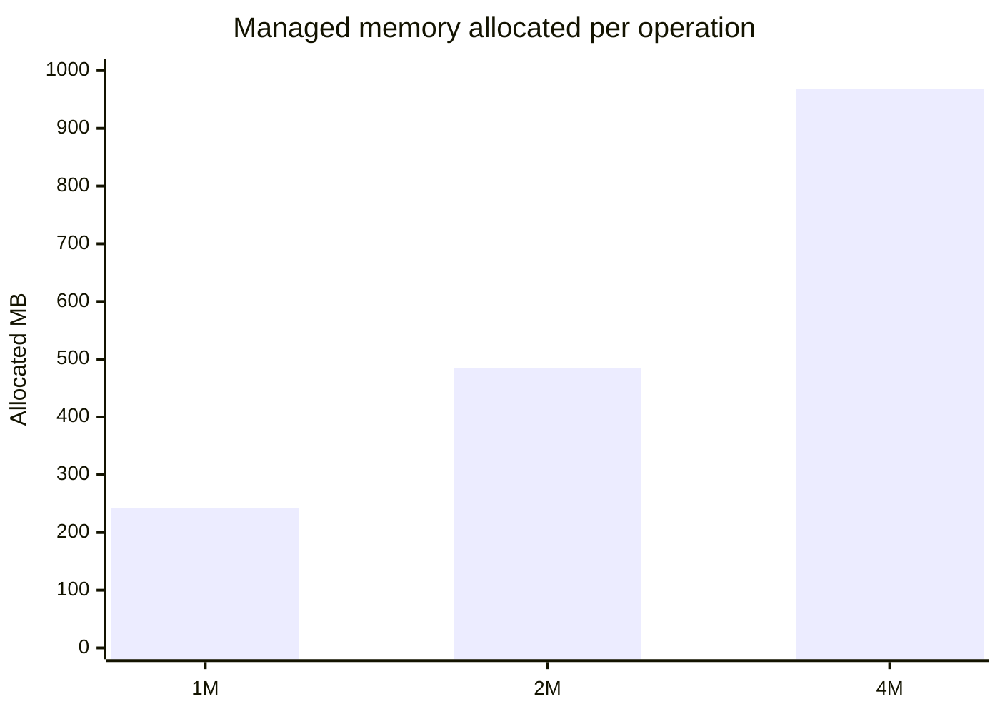
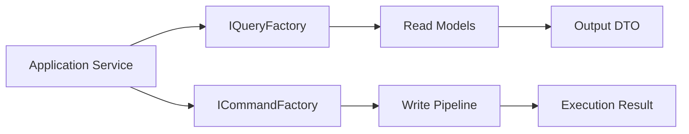
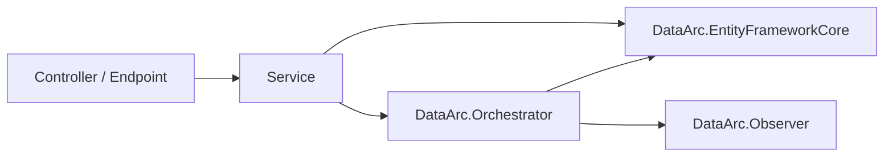

# DataArc.EntityFrameworkCore Demo

> A deterministic EF Core execution layer for modular, high-throughput, multi-context systems.

This repository demonstrates **DataArc.EntityFrameworkCore** inside a small modular .NET application.

The demo is intentionally focused. It does not try to model a large business domain. It shows how DataArc coordinates EF Core work across multiple persistence boundaries using explicit query and command pipelines.

## Start Here

Recommended reading order:

1. `Program.cs`
2. `Application/Modules/Finance/Registration/FinanceModuleRegistration.cs`
3. `Application/Modules/Finance/Features/SalaryAdjustments/Services/SalaryAdjustmentService.cs`
4. `Application/Modules/Finance/Features/EmployeePerformance/Services/EmployeePerformanceService.cs`
5. `Persistence/PersistenceRegistration.cs`
6. `Persistence/Database/DbContexts`
7. `DataArc.EntityFrameworkCore.Demo.Benchmark`

## What DataArc.EntityFrameworkCore Is

**DataArc.EntityFrameworkCore** is an execution layer for EF Core-based systems.

EF Core works well inside one `DbContext`. Real systems often need workflows that cross multiple `DbContext` boundaries.

DataArc gives those workflows an explicit execution model for:

- modular context boundaries
- command/query separation
- bulk operations
- cross-context workflows
- parallel execution
- structured execution results
- transaction-safe command flows
- logging-friendly outcomes
- high-volume scheduled workloads

DataArc does not replace EF Core. It coordinates EF Core execution.

## What This Demo Shows

The demo uses a simple finance workflow:

1. Reset and create demo databases.
2. Seed HR employee data.
3. Read employees from the HR persistence boundary.
4. Apply salary adjustment rules.
5. Bulk distribute adjusted employee data into Finance, IT, and Operations persistence boundaries.
6. Execute the command pipeline in parallel.
7. Query top-rated employee details.
8. Print a concise summary.



The central idea:

```text
Define the workflow.
Choose the execution context.
Build the command or query pipeline.
Execute across context boundaries.
Receive a structured result.
```

## Project Structure

```text
DataArc.EntityFrameworkCore.Demo
│
├── Application
│   └── Modules
│       └── Finance
│           ├── Features
│           │   ├── SalaryAdjustments
│           │   │   └── Services
│           │   │       ├── ISalaryAdjustmentService.cs
│           │   │       └── SalaryAdjustmentService.cs
│           │   └── EmployeePerformance
│           │       ├── Dtos
│           │       │   └── EmployeeDto.cs
│           │       └── Services
│           │           ├── IEmployeePerformanceService.cs
│           │           └── EmployeePerformanceService.cs
│           └── Registration
│               └── FinanceModuleRegistration.cs
│
├── Persistence
│   ├── Database
│   │   ├── DbContexts
│   │   │   ├── FinanceDbContext.cs
│   │   │   ├── HrDbContext.cs
│   │   │   ├── ItDbContext.cs
│   │   │   └── OperationsDbContext.cs
│   │   └── DbModels
│   │       ├── Employee.cs
│   │       └── Employer.cs
│   ├── Seeding
│   │   ├── DatabaseCreator.cs
│   │   ├── DatabaseSeeder.cs
│   │   └── SeedDataGenerator.cs
│   └── PersistenceRegistration.cs
│
└── Program.cs
```

The application module owns the feature flow.

The persistence layer owns EF Core contexts, database models, seeding, and DataArc execution context registration.

## Demo Workflow

### Salary Adjustment Use Case

`SalaryAdjustmentService` reads employees from HR, adjusts salary data, and writes adjusted data into Finance, IT, and Operations.



Core shape:

```csharp
var employeesQuery = await _queryFactory.CreateQueryAsync();

var employees = await employeesQuery
    .UseDbExecutionContext<IHrDbContext>()
        .ReadWhereAsync<Employee>(employee => employee.Salary > salaryThreshold);

foreach (var employee in employees)
{
    employee.Salary += employee.Salary * salaryAdjustmentBaseRate;
}

var commandBuilder = await _commandFactory.CreateCommandBuilderAsync();

commandBuilder
    .UseDbExecutionContext<IFinanceDbContext>()
        .AddBulk(employees, batchSize);

commandBuilder
    .UseDbExecutionContext<IItDbContext>()
        .AddBulk(employees, batchSize);

commandBuilder
    .UseDbExecutionContext<IOperationsDbContext>()
        .AddBulk(employees, batchSize);

var command = await commandBuilder.BuildAsync();
var commandResult = await command.ExecuteParallelAsync();

if (!commandResult.Success)
{
    throw new InvalidOperationException(
        $"Failed to process salary adjustments. {commandResult.Exception?.Message}");
}

return commandResult.TotalAffected;
```

### Employee Performance Query

`EmployeePerformanceService` demonstrates a cross-context read model.

It starts from HR employees above a rating threshold, joins related employees across Finance, IT, and Operations, then projects into a DTO.

```csharp
var topRatedEmployeesQuery = await _queryFactory.CreateQueryAsync();

var topRatedEmployees = await topRatedEmployeesQuery
    .UseDbExecutionContext<IHrDbContext, Employee>(employee => employee.Rating > rating)
        .Join<IFinanceDbContext, Employee>(
            bag => bag.Get<Employee>()!.Id,
            financeEmployee => financeEmployee.Id)
        .Join<IItDbContext, Employee>(
            bag => bag.Get<Employee>()!.Id,
            itEmployee => itEmployee.Id)
        .Join<IOperationsDbContext, Employee>(
            bag => bag.Get<Employee>()!.Id,
            operationsEmployee => operationsEmployee.Id)
    .Select(bag => new EmployeeDto
    {
        Id = bag.Get<Employee>()!.Id,
        Name = bag.Get<Employee>()!.Name!,
        Surname = bag.Get<Employee>()!.Surname!,
        Salary = bag.Get<Employee>()!.Salary!
    })
    .ToListAsync();
```

This shows the query side of the same idea:

```text
Multiple isolated contexts.
One explicit read model.
One application feature.
```

## DataArc Registration

The demo keeps each EF Core context isolated.

Each context is registered as a DataArc database execution context.

```csharp
services.AddDataArcCore();

services.ConfigureDataArc(dataArc =>
{
    dataArc.UseEntityFrameworkCore(ef =>
    {
        ef.AddDbExecutionContext<IFinanceDbContext, FinanceDbContext>(options =>
            options.UseSqlServer(financeConnectionString));

        ef.AddDbExecutionContext<IHrDbContext, HrDbContext>(options =>
            options.UseSqlServer(hrConnectionString));

        ef.AddDbExecutionContext<IItDbContext, ItDbContext>(options =>
            options.UseSqlServer(itConnectionString));

        ef.AddDbExecutionContext<IOperationsDbContext, OperationsDbContext>(options =>
            options.UseSqlServer(operationsConnectionString));
    });
});
```

A context interface marks the persistence boundary:

```csharp
public interface IFinanceDbContext : IExecutionContext<FinanceDbContext>
{
}

internal class FinanceDbContext : DbContext, IFinanceDbContext
{
    public FinanceDbContext(DbContextOptions<FinanceDbContext> options)
        : base(options)
    {
    }

    public DbSet<Employer> Employer { get; set; }

    public DbSet<Employee> Employee { get; set; }
}
```

## Database Setup

The demo uses DataArc database setup to create the participating demo databases.

The DDL/database builder is an advanced capability. In this demo, it is used only to prepare the databases required by the sample.

```csharp
var databaseBuilder = _databaseFactory.CreateDatabaseBuilder();

var databases = databaseBuilder
    .IncludeDbContext<FinanceDbContext>()
    .IncludeDbContext<HrDbContext>()
    .IncludeDbContext<ItDbContext>()
    .IncludeDbContext<OperationsDbContext>()
    .Build(applyChanges: true, generateScripts: false);

databases.ExecuteDrop();
databases.ExecuteCreate();
```

`applyChanges: true` is explicit because database build operations can change or drop database structures. `generateScripts: false` keeps the demo setup focused on creating the databases rather than generating DDL scripts.

## Benchmark

The benchmark measures DataArc parallel bulk insert execution across four EF Core persistence boundaries:

- `HrDbContext`
- `FinanceDbContext`
- `ItDbContext`
- `OperationsDbContext`

Each benchmark case inserts `RecordCount` employees into each participating context.

```text
Total inserted records = RecordCount x 4
Bulk batch size = 250,000
```

Benchmark shape:

```csharp
[Params(250_000, 500_000, 1_000_000)]
public int RecordCount { get; set; }

[Params(250_000)]
public int BulkBatchSize { get; set; }
```

Execution shape:

```csharp
var commandBuilder = await _commandFactory.CreateCommandBuilderAsync();

commandBuilder
    .UseDbExecutionContext<IHrDbContext>()
        .AddBulk(_benchmarkEmployees, BulkBatchSize);

commandBuilder
    .UseDbExecutionContext<IFinanceDbContext>()
        .AddBulk(_benchmarkEmployees, BulkBatchSize);

commandBuilder
    .UseDbExecutionContext<IItDbContext>()
        .AddBulk(_benchmarkEmployees, BulkBatchSize);

commandBuilder
    .UseDbExecutionContext<IOperationsDbContext>()
        .AddBulk(_benchmarkEmployees, BulkBatchSize);

var command = await commandBuilder.BuildAsync();
var commandResult = await command.ExecuteParallelAsync();
```



### Benchmark Environment

```text
BenchmarkDotNet v0.15.8
OS: Windows 11 25H2 / 2025 Update
CPU: 13th Gen Intel Core i7-13700H 2.40GHz
Cores: 14 physical, 20 logical
.NET SDK: 10.0.300
Runtime: .NET 8.0.27
JIT: RyuJIT x64
InvocationCount: 1
IterationCount: 10
WarmupCount: 1
UnrollFactor: 1
Diagnosers: MemoryDiagnoser, ThreadingDiagnoser
```

### Benchmark Results

| Method | Record Count | Bulk Batch Size | Total Inserted Records | Mean | StdDev | Completed Work Items | Lock Contentions | Gen0 | Allocated |
|---|---:|---:|---:|---:|---:|---:|---:|---:|---:|
| ExecuteParallelBulkInsertAsync | 250,000 | 250,000 | 1,000,000 | 1.520 s | 0.1270 s | 77,844 | - | 20,000 | 242.23 MB |
| ExecuteParallelBulkInsertAsync | 500,000 | 250,000 | 2,000,000 | 3.122 s | 0.4427 s | 156,401 | - | 40,000 | 484.37 MB |
| ExecuteParallelBulkInsertAsync | 1,000,000 | 250,000 | 4,000,000 | 5.580 s | 0.4736 s | 313,955 | - | 81,000 | 968.85 MB |

### Benchmark Trend





### Benchmark Validation

After the 4,000,000-record benchmark case completed, each participating database contained the expected 1,000,000 records.

```text
HrDbContext database:         1,000,000 Employee records
FinanceDbContext database:    1,000,000 Employee records
ItDbContext database:         1,000,000 Employee records
OperationsDbContext database: 1,000,000 Employee records
```

### Benchmark Notes

These results are workload-specific evidence, not a universal performance guarantee.

Results depend on:

- hardware
- database provider
- database location
- schema shape
- entity size
- indexes
- batch size
- relationship graph complexity
- runtime version
- database state before each iteration
- transaction behavior

The useful engineering signal is not only elapsed time. The benchmark runs through a single explicit command pipeline, across four context boundaries, with structured success/failure reporting and no reported lock contentions in this run.

## Why Add DataArc.EntityFrameworkCore To Your Engineering Toolkit?

### 1. Preserve Modular EF Core Boundaries

Many real systems use one normalized database while still needing separate logical EF Core boundaries.

```text
IdentityContext
ProductsContext
PackagingContext
LicensingContext
PricingContext
AuditContext
```

DataArc lets teams preserve modular context boundaries without collapsing every model into one giant `DbContext`.

### 2. Give Cross-Context Workflows An Execution Model

Real workflows often need data from multiple persistence boundaries:

- identity + licensing
- products + packages
- pricing + entitlements
- audit + activations
- HR + finance + operations

DataArc gives those workflows a C# execution model across contexts.

### 3. Coordinate Parallel Operations

EF Core can run multiple `DbContext` instances in parallel when each path has its own context instance and lifecycle.

DataArc turns the coordination into a command pipeline with structured results:

```csharp
var commandBuilder = await _commandFactory.CreateCommandBuilderAsync();

commandBuilder
    .UseDbExecutionContext<IFinanceDbContext>()
        .AddBulk(financeEmployees, batchSize);

commandBuilder
    .UseDbExecutionContext<IItDbContext>()
        .AddBulk(itEmployees, batchSize);

commandBuilder
    .UseDbExecutionContext<IOperationsDbContext>()
        .AddBulk(operationsEmployees, batchSize);

var command = await commandBuilder.BuildAsync();
var result = await command.ExecuteParallelAsync();
```

### 4. Separate Reads From Writes At The Execution Layer

DataArc separates reads and writes through dedicated query and command APIs.



This gives teams CQRS-style execution discipline at the persistence layer without requiring every operation to become a request/handler class.

### 5. Reduce Repository Coordination Sprawl

A repository-per-table design can grow quickly:

```text
UserRepository
ProductRepository
PackageRepository
LicenseRepository
UserLicenseRepository
UserProductRepository
ActivationRepository
ProductPackageRepository
```

The workflow still needs to coordinate those repositories.

DataArc lets teams compose directly against known EF Core context boundaries through command/query builders.

```text
DbContexts are persistence boundaries.
DataArc is the execution layer.
Orchestrators are workflow boundaries.
```

Repositories can still be used where they add value.

### 6. Support Cross-Context Read Models

DataArc supports cross-context read model composition using a bag pattern.

Each join adds data to the bag. The final projection creates a workflow-specific read model.

```csharp
var rows = await query
    .UseDbExecutionContext<IIntersectionContext, UserProduct>(
        userProduct => userProduct.UserId == userId)
    .Join<IProductsContext, Product>(
        bag => bag.Get<UserProduct>()!.ProductId,
        product => product.Id)
    .Join<IPackagingContext, Package>(
        bag => bag.Get<Product>()!.PackageId,
        package => package.Id)
    .Select(bag => new ProductPackageRow
    {
        ProductName = bag.Get<Product>()!.Name,
        PackageName = bag.Get<Package>()!.Name
    })
    .ToListAsync();
```

### 7. Improve Observability Through Structured Results

DataArc wraps execution in structured results:

```csharp
var result = await command.ExecuteParallelAsync();

if (!result.Success)
{
    logger.LogError(result.Exception, "Command failed.");
    return;
}
```

DataArc results are designed to support:

- success/failure
- exception details
- per-context reporting
- overall execution reporting
- logging-friendly outcomes
- transaction-safe command flows
- performance visibility

### 8. Support High-Volume Scheduled Workloads

Many systems run large data operations on a schedule:

```text
Month-end billing
Year-end processing
License renewals
Entitlement recalculation
Product imports
Customer migrations
Reconciliation jobs
Audit/archive jobs
Activation sweeps
Tenant provisioning
Reporting snapshots
```

These jobs may not run every minute. When they run, they affect memory, CPU, database load, deployment sizing, and cost.

DataArc is built for those moments.

## When To Use Direct DbContext

Use `DbContext` directly when the operation is simple and stays inside one persistence boundary.

```csharp
dbContext.Set<Employee>().Add(employee);
await dbContext.SaveChangesAsync();
```

Use DataArc.EntityFrameworkCore when the workflow needs:

- multiple contexts
- bulk operations
- parallel execution
- structured execution results
- context switching
- cross-context read models
- transaction-safe command flows
- logging and performance visibility

```text
DbContext is excellent inside one persistence boundary.
DataArc coordinates execution across boundaries.
```

## Where Orchestrators Fit

DataArc.EntityFrameworkCore can be used directly in services, as this demo shows.

When workflows become larger, move the workflow into **DataArc.Orchestrator**.

For post-execution outcomes, use **DataArc.Observer**.



## Running The Demo

### 1. Configure Connection Strings

Update the SQL Server connection strings in `PersistenceRegistration.cs`.

```csharp
var financeConnectionString =
    "Server=YOUR_SERVER;Database=FinanceDb;Integrated Security=true;TrustServerCertificate=True;";

var hrConnectionString =
    "Server=YOUR_SERVER;Database=HrDb;Integrated Security=true;TrustServerCertificate=True;";

var itConnectionString =
    "Server=YOUR_SERVER;Database=ItDb;Integrated Security=true;TrustServerCertificate=True;";

var operationsConnectionString =
    "Server=YOUR_SERVER;Database=OperationsDb;Integrated Security=true;TrustServerCertificate=True;";
```

### 2. Run The Application

```bash
dotnet run
```

The application will:

1. Delete existing demo databases.
2. Create demo databases.
3. Seed HR employee data.
4. Run the salary adjustment workflow.
5. Bulk distribute adjusted employee data into Finance, IT, and Operations.
6. Query top-rated employee details.
7. Print a summary.

Expected summary shape:

```text
Database deleted successfully.
Database created successfully.
Database seeded successfully.

Top Rated Employee: Name12345 Surname12345, Salary: 151234.56, Number of top rated employees: 1234
Press any key to exit.
```

## Running The Benchmark

From the benchmark project:

```bash
dotnet run -c Release
```

BenchmarkDotNet will generate detailed output under the benchmark artifacts folder.

## Trial Path

DataArc.EntityFrameworkCore supports a 14-day trial so teams can test real workloads before purchasing.

Use the trial to validate:

- modular context boundaries
- cross-context queries
- command pipelines
- bulk operations
- scheduled workload behavior
- logging and execution reporting

## Summary

DataArc.EntityFrameworkCore gives EF Core a deterministic execution layer for modular, high-throughput, multi-context systems.

It helps teams:

- preserve modular context boundaries
- compose cross-context workflows
- execute coordinated command pipelines
- run parallel operations
- reduce repository and handler coordination sprawl
- build cross-context read models
- run bulk workloads with controlled memory behavior
- return structured execution results
- log and measure workflow execution

Most architectures define structure.

**DataArc controls execution.**
