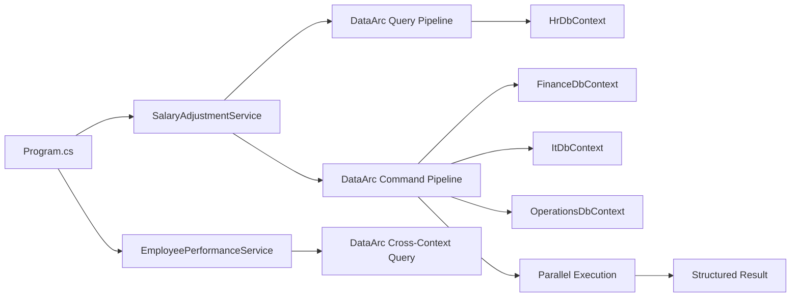
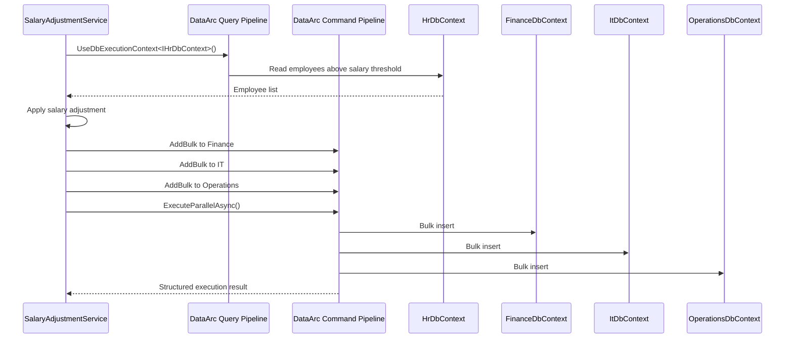
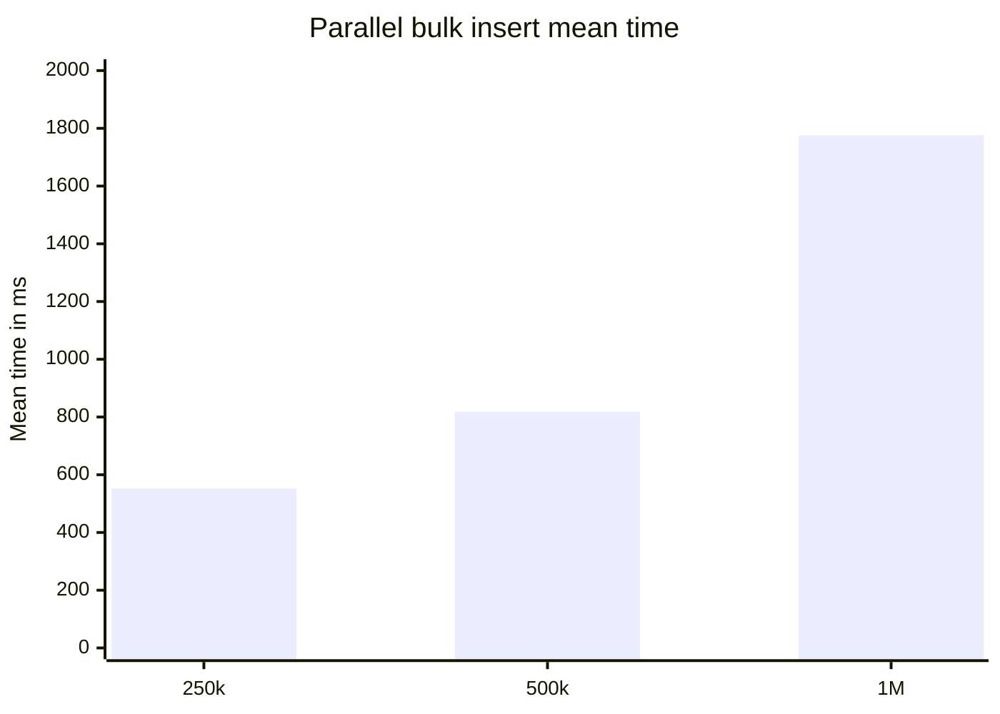
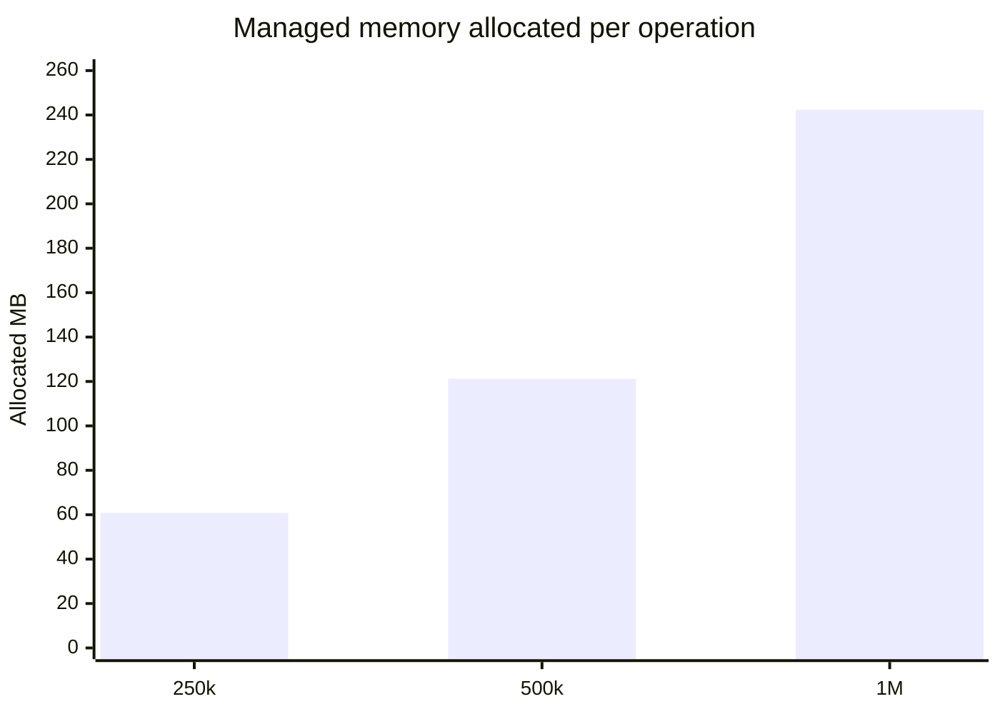

# DataArc.EntityFrameworkCore

> EF Core execution for workflows that need isolated `DbContext` boundaries, bulk operations, cross-context reads, parallel writes, and structured results.

**DataArc.EntityFrameworkCore** utilises EF Core.

It providates a dedicated execution layer that allows application code to coordinate data work across multiple `DbContext` boundaries without turning the workflow into a pile of repository calls, handler classes, or manual `DbContext` plumbing.

This demo shows the product in a small finance-style workflow:

```text
Read employees from HR.
Apply salary adjustment rules.
Bulk write the adjusted data into Finance, IT, and Operations.
Query the resulting data across all four contexts.
Return structured execution results.
```

---

## What DataArc Adds To EF Core

The demo proves four practical things:

1. **Explicit execution boundaries**  
   Application code chooses which EF Core boundary should execute the work.

2. **Parallel bulk writes**  
   One command pipeline writes to multiple EF Core contexts in parallel.

3. **Cross-context reads**  
   One query pipeline can compose a read model across multiple contexts.

4. **Structured results**  
   Command execution returns success/failure, affected records, and exception detail in one result shape.

The central idea:

```text
Use EF Core.
Keep DbContexts isolated.
Choose execution boundaries explicitly.
Build command/query pipelines.
Execute the workflow.
Receive structured results.
```

---

## Benchmark Snapshot

The benchmark inserts employee records into four EF Core contexts:

- `HrDbContext`
- `FinanceDbContext`
- `ItDbContext`
- `OperationsDbContext`

Each benchmark case inserts `RecordCount` employees into each participating context.

```text
Total inserted records = RecordCount x 4
```

| Method | Record Count Per Context | Bulk Batch Size | Total Inserted Records | Mean | StdDev | Allocated |
|---|---:|---:|---:|---:|---:|---:|
| ExecuteParallelBulkInsertAsync | 62,500 | 62,500 | 250,000 | 552.2 ms | 84.94 ms | 60.83 MB |
| ExecuteParallelBulkInsertAsync | 125,000 | 62,500 | 500,000 | 818.4 ms | 90.35 ms | 121.19 MB |
| ExecuteParallelBulkInsertAsync | 250,000 | 62,500 | 1,000,000 | 1,775.7 ms | 344.70 ms | 242.31 MB |

These results are workload-specific evidence, not a universal performance guarantee. Hardware, SQL Server configuration, schema shape, indexes, batch size, runtime version, and database state all affect results.

The useful signal is the execution shape: one explicit command pipeline, four EF Core contexts, parallel execution, structured result handling, and no reported lock contentions in this run.

---

## Why DataArc.EntityFrameworkCore Exists

EF Core is excellent inside one `DbContext`.

Many systems eventually need data workflows that move beyond one direct context call:

- read from one database and write to another
- import data into multiple tables or contexts
- synchronize data between operational stores
- build reporting or workflow projections
- reconcile data across multiple persistence boundaries
- bulk process scheduled jobs
- compose read models from more than one EF Core context

DataArc.EntityFrameworkCore gives those workflows an explicit C# execution model.

It is designed for EF Core work that needs:

- isolated context boundaries
- command/query separation
- bulk operations
- parallel execution
- cross-context reads
- structured execution results
- transaction-aware command flows
- logging-friendly outcomes
- high-volume scheduled jobs
- predictable workflow execution

Small CRUD applications can often be scaffolded, generated, and maintained with standard EF Core patterns.

DataArc.EntityFrameworkCore adds the most value when the data work becomes coordinated: multiple boundaries, larger data movement, repeatable workflows, clear execution results, and predictable success or failure reporting.

The value is giving EF Core work an explicit execution model.

---

## Demo Workflow

The demo uses four isolated EF Core persistence boundaries:

```text
HrDbContext
FinanceDbContext
ItDbContext
OperationsDbContext
```

The application flow:

1. Deletes existing demo databases.
2. Creates the demo databases.
3. Generates SQL scripts for the database operations.
4. Seeds employee data into HR.
5. Reads employees from HR.
6. Applies salary adjustment rules.
7. Bulk writes adjusted data into Finance, IT, and Operations.
8. Executes the command pipeline in parallel.
9. Queries top-rated employees across all four contexts.
10. Prints a short summary.



---

## Application Shape

`Program.cs` stays small.

It prepares the demo databases, runs the salary adjustment workflow, then queries a concise result.

```csharp
const int batchSize = 100_000;

var serviceProvider = new ServiceCollection()
    .AddFinanceModule()
    .BuildServiceProvider();

var databaseCreators = new IDatabaseCreator[]
{
    serviceProvider.GetRequiredService<IFinanceDbCreator>(),
    serviceProvider.GetRequiredService<IHrDbCreator>(),
    serviceProvider.GetRequiredService<IItDbCreator>(),
    serviceProvider.GetRequiredService<IOperationsDbCreator>()
};

var databaseSeeders = new IDatabaseSeeder[]
{
    serviceProvider.GetRequiredService<IHrDbSeeder>()
};

var salaryAdjustmentService =
    serviceProvider.GetRequiredService<ISalaryAdjustmentService>();

var employeePerformanceService =
    serviceProvider.GetRequiredService<IEmployeePerformanceService>();

await ResetDatabasesAsync(databaseCreators, databaseSeeders, batchSize);

var processedCount = await salaryAdjustmentService
    .ProcessEmployeeSalaryAdjustmentsAsync(
        salaryAdjustmentBaseRate: 0.05m,
        salaryThreshold: 10_000m,
        batchSize);

Console.WriteLine($"Processed salary adjustment records: {processedCount:N0}");

var topRatedEmployees = await employeePerformanceService
    .GetTopRatedEmployeesAsync(rating: 4.5);
```

The repetitive bulk-operation detail belongs inside the use-case service, not in `Program.cs`.

---

## Salary Adjustment Use Case

`SalaryAdjustmentService` reads from HR, applies the adjustment, then writes to three target contexts through one command pipeline.



Core shape:

```csharp
var employeesQuery = await _queryFactory.CreateQueryAsync();

var employees = await employeesQuery
    .UseDbExecutionContext<IHrDbContext>()
        .ReadWhereAsync<Employee>(employee => employee.Salary > salaryThreshold);

foreach (var employee in employees)
{
    employee.Salary += employee.Salary * salaryAdjustmentBaseRate;
}

var commandBuilder = await _commandFactory.CreateCommandBuilderAsync();

commandBuilder
    .UseDbExecutionContext<IFinanceDbContext>()
        .AddBulk(employees, batchSize);

commandBuilder
    .UseDbExecutionContext<IItDbContext>()
        .AddBulk(employees, batchSize);

commandBuilder
    .UseDbExecutionContext<IOperationsDbContext>()
        .AddBulk(employees, batchSize);

var command = await commandBuilder.BuildAsync();
var commandResult = await command.ExecuteParallelAsync();

if (!commandResult.Success)
{
    throw new InvalidOperationException(
        $"Failed to process salary adjustments. {commandResult.Exception?.Message}");
}

return commandResult.TotalAffected;
```

The repeated `UseDbExecutionContext<T>()` calls are intentional. Each write target is explicit, visible, and independently routed.

---

## Cross-Context Query Use Case

`EmployeePerformanceService` demonstrates a cross-context read model.

It starts from HR employees above a rating threshold, joins related employees across Finance, IT, and Operations, then projects the result into a DTO.

```csharp
var topRatedEmployeesQuery = await _queryFactory.CreateQueryAsync();

var topRatedEmployees = await topRatedEmployeesQuery
    .UseDbExecutionContext<IHrDbContext, Employee>(employee => employee.Rating > rating)
        .Join<IFinanceDbContext, Employee>(
            bag => bag.Get<Employee>()!.Id,
            financeEmployee => financeEmployee.Id)
        .Join<IItDbContext, Employee>(
            bag => bag.Get<Employee>()!.Id,
            itEmployee => itEmployee.Id)
        .Join<IOperationsDbContext, Employee>(
            bag => bag.Get<Employee>()!.Id,
            operationsEmployee => operationsEmployee.Id)
    .Select(bag => new EmployeeDto
    {
        Id = bag.Get<Employee>()!.Id,
        Name = bag.Get<Employee>()!.Name!,
        Surname = bag.Get<Employee>()!.Surname!,
        Salary = bag.Get<Employee>()!.Salary
    })
    .ToListAsync();
```

This creates one read model from multiple isolated EF Core contexts without exposing the concrete `DbContext` implementations to application code.

---

## Internal DbContexts, Public Execution Boundaries

The demo keeps concrete EF Core `DbContext` implementations internal to the persistence project.

Application code does not depend directly on `FinanceDbContext`, `HrDbContext`, `ItDbContext`, or `OperationsDbContext`.

Instead, each EF Core boundary is exposed through a small public execution-context interface.

In DataArc, an execution context represents a logical boundary where work is performed. In this demo, each execution context is backed by an EF Core `DbContext`.

```csharp
public interface IFinanceDbContext : IExecutionContext
{
}
```

The concrete context remains internal:

```csharp
internal class FinanceDbContext : DbContext, IFinanceDbContext
{
    public FinanceDbContext(DbContextOptions<FinanceDbContext> dbContextOptions)
        : base(dbContextOptions)
    {
    }

    public DbSet<Employer>? Employer { get; set; }

    public DbSet<Employee>? Employee { get; set; }

    protected override void OnModelCreating(ModelBuilder modelBuilder)
    {
        base.OnModelCreating(modelBuilder);

        modelBuilder
            .Entity<Employer>()
            .Property(employer => employer.Description)
            .HasColumnType("text");
    }
}
```

Application services route work through the public execution boundary:

```csharp
commandBuilder
    .UseDbExecutionContext<IFinanceDbContext>()
        .AddBulk(employees, batchSize);
```

This keeps EF Core implementation details inside the persistence layer while still allowing application code to choose exactly where work executes.

---

## DataArc Registration

Each EF Core context is registered as a DataArc database execution context.

```csharp
services.AddDataArcCore();

services.ConfigureDataArc(dataArc =>
{
    dataArc.UseEntityFrameworkCore(ef =>
    {
        ef.AddDbExecutionContext<IFinanceDbContext, FinanceDbContext>(options =>
            options.UseSqlServer(financeConnectionString));

        ef.AddDbExecutionContext<IHrDbContext, HrDbContext>(options =>
            options.UseSqlServer(hrConnectionString));

        ef.AddDbExecutionContext<IItDbContext, ItDbContext>(options =>
            options.UseSqlServer(itConnectionString));

        ef.AddDbExecutionContext<IOperationsDbContext, OperationsDbContext>(options =>
            options.UseSqlServer(operationsConnectionString));
    });
});
```

The registration tells DataArc:

```text
This interface is the execution boundary.
This concrete DbContext is the EF Core implementation.
This connection string points to the target database.
```

---

## Database Creation Without EF Core Migration Files

The demo does not use EF Core migration files.

Each database has its own familiar creator:

```text
FinanceDbCreator
HrDbCreator
ItDbCreator
OperationsDbCreator
```

Each creator implements EF Core's `IDatabaseCreator` shape and uses DataArc's database builder to create its database from the current `DbContext` model.

Example:

```csharp
public class FinanceDbCreator : IFinanceDbCreator
{
    private readonly IDatabaseFactory _databaseFactory;

    public FinanceDbCreator(IDatabaseFactory databaseFactory)
    {
        _databaseFactory = databaseFactory;
    }

    public bool EnsureCreated()
    {
        var dbBuilder = _databaseFactory.CreateDatabaseBuilder();

        var db = dbBuilder
            .IncludeDbContext<FinanceDbContext>()
            .Build(generateScripts: true, applyChanges: true);

        db.ExecuteCreate();

        return true;
    }

    public bool EnsureDeleted()
    {
        var dbBuilder = _databaseFactory.CreateDatabaseBuilder();

        var db = dbBuilder
            .IncludeDbContext<FinanceDbContext>()
            .Build(generateScripts: true, applyChanges: true);

        db.ExecuteDrop();

        return true;
    }
}
```

EF Core's `EnsureCreated()` can create a database from a model. DataArc's builder adds reviewable script generation without requiring EF Core migration files in this demo.

Generated SQL scripts are written to the app output directory under `Scripts`.

Example:

```text
bin/Debug/net8.0/Scripts
```

The generated scripts include database creation, schema creation, table creation, and constraints.

```sql
CREATE DATABASE [FinanceDb];
GO

USE [FinanceDb];
GO

IF SCHEMA_ID('employees') IS NULL EXEC('CREATE SCHEMA [employees]');
GO

CREATE TABLE [employees].[Employees] (
    [Id] int IDENTITY(1,1) NOT NULL,
    [EmployeeName] varchar(50) NULL,
    [EmployeeSalary] decimal(33,2) NOT NULL,
    PRIMARY KEY ([Id])
);
GO
```

---

## Project Structure

```text
DataArc.EntityFrameworkCore.Demo
│
├── Application
│   └── Modules
│       └── Finance
│           ├── Features
│           │   ├── SalaryAdjustments
│           │   │   ├── Dtos
│           │   │   │   └── EmployeeDto.cs
│           │   │   └── Services
│           │   │       ├── ISalaryAdjustmentService.cs
│           │   │       └── SalaryAdjustmentService.cs
│           │   └── EmployeePerformance
│           │       └── Services
│           │           ├── IEmployeePerformanceService.cs
│           │           └── EmployeePerformanceService.cs
│           └── Registration
│               └── FinanceModuleRegistration.cs
│
├── Persistence
│   ├── Database
│   │   ├── Creator
│   │   │   ├── FinanceDbCreator.cs
│   │   │   ├── HrDbCreator.cs
│   │   │   ├── ItDbCreator.cs
│   │   │   └── OperationsDbCreator.cs
│   │   ├── DbContexts
│   │   │   ├── FinanceDbContext.cs
│   │   │   ├── HrDbContext.cs
│   │   │   ├── ItDbContext.cs
│   │   │   └── OperationsDbContext.cs
│   │   ├── DbModels
│   │   │   ├── Employee.cs
│   │   │   └── Employer.cs
│   │   └── Seeder
│   │       ├── HrDbSeeder.cs
│   │       └── SeedDataGenerator.cs
│   └── PersistenceRegistration.cs
│
└── Program.cs
```

The application project owns the use cases.

The persistence project owns EF Core contexts, database models, database creation, seeding, and DataArc registration.

---

## Running The Demo

### 1. Configure Connection Strings

Update the SQL Server connection strings in `PersistenceRegistration.cs`.

```csharp
var financeConnectionString =
    "Server=YOUR_SERVER;Database=FinanceDb;Integrated Security=true;TrustServerCertificate=True;";

var hrConnectionString =
    "Server=YOUR_SERVER;Database=HrDb;Integrated Security=true;TrustServerCertificate=True;";

var itConnectionString =
    "Server=YOUR_SERVER;Database=ItDb;Integrated Security=true;TrustServerCertificate=True;";

var operationsConnectionString =
    "Server=YOUR_SERVER;Database=OperationsDb;Integrated Security=true;TrustServerCertificate=True;";
```

### 2. Run The Application

The demo multi-targets .NET 6, 7, 8, 9, and 10.

Example:

```bash
dotnet run --framework net8.0
```

The application will:

1. Delete existing demo databases.
2. Create demo databases.
3. Generate SQL scripts under the app output `Scripts` folder.
4. Seed HR employee data.
5. Run the salary adjustment workflow.
6. Bulk distribute adjusted employee data into Finance, IT, and Operations.
7. Query top-rated employee details.
8. Print a summary.

Expected summary shape:

```text
Databases deleted successfully.
Databases created successfully.
Databases seeded successfully.
Processed salary adjustment records: 300,000

Top Rated Employee: Name12345 Surname12345, Salary: 151,234.56, Number of top rated employees: 1,234

Press any key to exit.
```

---

## Running The Benchmark

From the benchmark project:

```bash
dotnet run -c Release --framework net8.0
```

Default benchmark shape:

```csharp
[Params(62_500, 125_000, 250_000)]
public int RecordCount { get; set; }

[Params(62_500)]
public int BulkBatchSize { get; set; }
```

BenchmarkDotNet will generate detailed output under the benchmark artifacts folder.

### Benchmark Environment

```text
BenchmarkDotNet v0.15.8
OS: Windows 11 25H2 / 2025 Update
CPU: 13th Gen Intel Core i7-13700H 2.40GHz
Cores: 14 physical, 20 logical
.NET SDK: 10.0.300
Runtime: .NET 8.0.27
JIT: RyuJIT x64
InvocationCount: 1
IterationCount: 10
WarmupCount: 1
UnrollFactor: 1
Diagnosers: MemoryDiagnoser, ThreadingDiagnoser
```

### Benchmark Trend





---

## Trial Path

DataArc.EntityFrameworkCore supports a 14-day trial so teams can test real workloads before purchasing.

Use the trial to validate:

- cross-context queries
- command pipelines
- bulk operations
- scheduled workload behavior
- logging and execution reporting

---

## Related DataArc Packages

DataArc.EntityFrameworkCore can be used directly in services, as this demo shows.

For larger workflow coordination, use **DataArc.Orchestrator**.

For post-execution outcomes, use **DataArc.Observer**.

This README focuses on the EF Core execution package. Broader workflow architecture belongs in the orchestration demo.

---

## Summary

DataArc.EntityFrameworkCore gives EF Core an explicit execution layer for high-throughput workflows that cross `DbContext` boundaries.

It helps teams:

- keep concrete `DbContext` implementations internal
- expose public execution-context interfaces
- coordinate work across multiple EF Core contexts
- execute bulk command pipelines
- run parallel operations
- compose cross-context read models
- create databases and generate scripts without EF Core migration files in this demo path
- return structured execution results
- log and measure workflow execution

**EF Core owns data access.**

**DataArc controls execution.**
