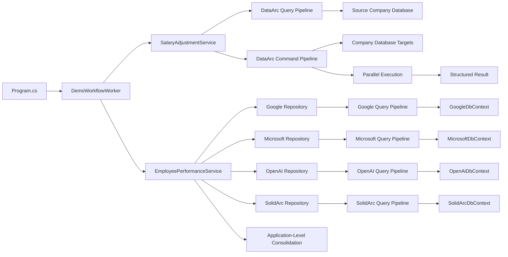
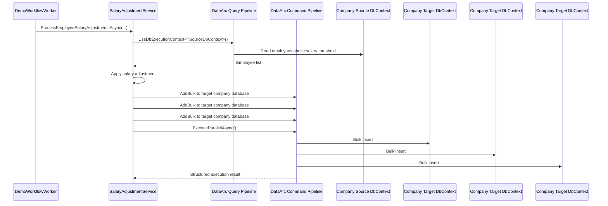
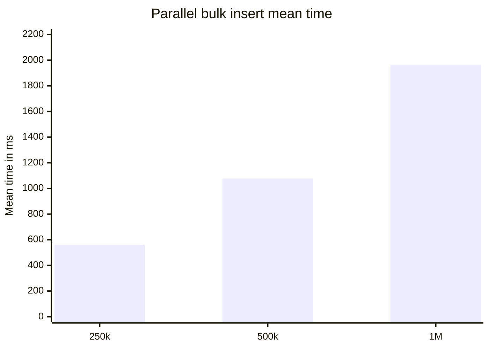
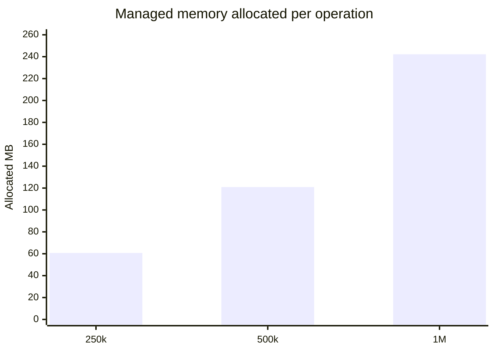

# DataArc.EntityFrameworkCore Demo

> Fast, explicit EF Core execution for background workers, batch jobs, company database onboarding, bulk operations, parallel writes, database/script generation, and structured execution results.

**DataArc.EntityFrameworkCore** uses EF Core and adds a dedicated execution layer for workflows that need to target more than one `DbContext` or database boundary.

This demo runs as a small .NET generic-host worker. It models fast employee data processing across four separate company databases:

```text
SAS_GoogleDb
SAS_MicrosoftDb
SAS_OpenAiDb
SAS_Db
```

Each company database has its own EF Core `DbContext`, its own public DataArc execution-context contract, and its own database creation/seed path.

The workflow:

```text
Create and seed four separate company databases.
Read employees through explicit company execution boundaries.
Apply salary adjustment rules.
Bulk write adjusted employee data.
Query top-rated employees per company database.
Consolidate the result in application code.
Return structured execution results.
```

The demo intentionally avoids a repository-per-table design. Repositories describe meaningful workflow operations, such as getting top-rated employees from a company database, rather than wrapping every table with a generic repository.

---

## What This Demo Shows

This demo focuses on a practical EF Core problem:

> How do you run repeatable, high-volume data workflows across separate database boundaries without spreading EF Core plumbing across the application?

DataArc.EntityFrameworkCore gives the workflow an execution model:

```text
Use EF Core.
Hide concrete DbContexts.
Expose public execution-context contracts.
Choose execution boundaries explicitly.
Build command/query pipelines.
Execute the workflow.
Receive structured results.
```

A .NET `BackgroundService` gives the workflow a familiar host.

DataArc.EntityFrameworkCore gives the workflow its execution layer.

---

## Key Benefits Demonstrated

### 1. Hidden DbContexts

Concrete EF Core `DbContext` classes stay inside the persistence layer.

Application code targets public DataArc execution-context contracts such as:

```csharp
IGoogleDbContext
IMicrosoftDbContext
IOpenAiDbContext
ISolidArcDbContext
```

This keeps EF Core implementation detail out of the workflow code.

### 2. Less Repository-Per-Table Sprawl

The demo uses repositories as intention-revealing workflow boundaries.

Instead of creating this kind of shape:

```text
IEmployeeRepository
IEmployeeRatingRepository
IEmployeeSalaryRepository
IUnitOfWork
TopRatedEmployeeService
```

the demo uses focused operations:

```csharp
_googleRepository.GetTopRatedEmployeesAsync(rating);
_microsoftRepository.GetTopRatedEmployeesAsync(rating);
_openAiRepository.GetTopRatedEmployeesAsync(rating);
_solidArcRepository.GetTopRatedEmployeesAsync(rating);
```

The repository describes the business operation. DataArc handles execution routing.

### 3. No Command/Query Class Explosion

The demo does not need command and query files for every table and database permutation.

Instead of creating separate command/query classes for every operation, the workflow uses factory interfaces:

```csharp
ICommandFactory
IQueryFactory
```

That gives the application CQRS-style separation without forcing a file-per-operation structure for every database/table combination.

### 4. Explicit Execution Boundaries

Every query or command chooses the database boundary that should execute the work.

Example:

```csharp
var topRatedEmployeesQuery = await _queryFactory.CreateQueryAsync();

var topRatedEmployees = await topRatedEmployeesQuery
    .UseDbExecutionContext<IGoogleDbContext>()
    .ReadWhereAsync<Employee>(employee => employee.Rating > rating);
```

The important part is explicit:

```csharp
.UseDbExecutionContext<IGoogleDbContext>()
```

That tells DataArc which EF Core boundary should run the query.

### 5. Bulk and Parallel Operations

The demo runs high-volume EF Core work using DataArc command pipelines.

The command pipeline can target multiple execution contexts and then execute the work in parallel.

### 6. Database and Script Generation Without EF Core Migration Files

The demo creates databases from the current EF Core models and generates SQL scripts without requiring EF Core migration files in this sample path.

That makes the demo easy to reset, inspect, and run.

### 7. Persistence Layer Flexibility

Application code targets contracts and factories instead of concrete EF Core classes.

That makes the persistence layer easier to reorganize, replace, test, or split over time because workflow code is not coupled directly to concrete `DbContext` implementations.

---

## Demo Workflow

The demo uses four isolated company database boundaries:

```text
GoogleDbContext
MicrosoftDbContext
OpenAiDbContext
SolidArcDbContext
```

The application flow:

1. Deletes existing demo databases.
2. Creates the demo databases.
3. Generates SQL scripts for database operations.
4. Seeds company data.
5. Starts a .NET hosted worker.
6. Runs the salary adjustment workflow.
7. Executes bulk work through DataArc command pipelines.
8. Queries top-rated employees from each company database independently.
9. Consolidates top-rated employees in application code.
10. Prints a short summary.
11. Stops the host after the workflow completes.



---

## Application Shape

The solution uses a host/application/contracts/persistence split.

```text
DataArc.EntityFrameworkCore.Demo.Host
    Starts the generic host and hosted worker.

DataArc.EntityFrameworkCore.Demo
    Owns application services, modules, repositories, and workflow code.

DataArc.EntityFrameworkCore.Demo.Contracts
    Owns public DTOs and application contracts.

DataArc.EntityFrameworkCore.Demo.Persistence
    Owns EF Core contexts, execution-context contracts, database creators, seeders, and DataArc registration.

DataArc.EntityFrameworkCore.Demo.Benchmark
    Runs BenchmarkDotNet benchmarks against the DataArc EF Core execution path.
```

The host starts the workflow. The application project expresses the workflow. The persistence project owns EF Core implementation detail.

---

## Project Structure

Current high-level structure:

```text
DataArc.EntityFrameworkCore.Demo
│
├── Application
│   ├── Modules
│   │   ├── Google
│   │   │   └── Repository
│   │   │       └── GoogleRepository.cs
│   │   ├── Microsoft
│   │   │   └── Repository
│   │   │       └── MicrosoftRepository.cs
│   │   ├── OpenAi
│   │   │   └── Repository
│   │   │       └── OpenAiRepository.cs
│   │   └── SolidArc
│   │       └── Repository
│   │           └── SolidArcRepository.cs
│   │
│   ├── Features
│   │   ├── EmployeePerformance
│   │   │   └── Services
│   │   │       ├── IEmployeePerformanceService.cs
│   │   │       └── EmployeePerformanceService.cs
│   │   └── SalaryAdjustments
│   │       └── Services
│   │           ├── ISalaryAdjustmentService.cs
│   │           └── SalaryAdjustmentService.cs
│   │
│   └── Modules
│       └── DemoRegistration.cs
│
├── Contracts
│   └── Application
│       ├── Dtos
│       │   └── EmployeeDto.cs
│       └── Modules
│           ├── Google
│           ├── Microsoft
│           ├── OpenAi
│           └── SolidArc
│
├── Persistence
│   ├── DemoDatabaseInitializer.cs
│   ├── Contracts
│   │   ├── IGoogleDbContext.cs
│   │   ├── IMicrosoftDbContext.cs
│   │   ├── IOpenAiDbContext.cs
│   │   └── ISolidArcDbContext.cs
│   ├── Database
│   │   ├── Creator
│   │   ├── DBContexts
│   │   │   ├── GoogleDbContext.cs
│   │   │   ├── MicrosoftDbContext.cs
│   │   │   ├── OpenAiDbContext.cs
│   │   │   └── SolidArcDbContext.cs
│   │   ├── DBModels
│   │   │   ├── Employee.cs
│   │   │   └── Employer.cs
│   │   └── Seeders
│   └── PersistenceRegistration.cs
│
├── Host
│   ├── DemoWorkflowWorker.cs
│   ├── Program.cs
│   └── appsettings.json
│
└── Benchmark
    └── BenchmarkDotNet benchmark project
```

---

## Repository Example

A repository targets a meaningful workflow read, not a table wrapper.

```csharp
using DataArc.Core;
using DataArc.EntityFrameworkCore.Demo.Contracts.Application.Dtos;
using DataArc.EntityFrameworkCore.Demo.Contracts.Application.Modules.Google.Repository;
using DataArc.EntityFrameworkCore.Demo.Persistence.Contracts;
using DataArc.EntityFrameworkCore.Demo.Persistence.Database.DBModels;

namespace DataArc.EntityFrameworkCore.Demo.Application.Modules.Google.Repository
{
    internal class GoogleRepository : IGoogleRepository
    {
        private readonly IQueryFactory _queryFactory;

        public GoogleRepository(IQueryFactory queryFactory)
        {
            _queryFactory = queryFactory;
        }

        public async Task<List<EmployeeDto>> GetTopRatedEmployeesAsync(double rating)
        {
            var topRatedEmployeesQuery = await _queryFactory.CreateQueryAsync();

            var topRatedEmployees = await topRatedEmployeesQuery
                .UseDbExecutionContext<IGoogleDbContext>()
                .ReadWhereAsync<Employee>(employee => employee.Rating > rating);

            return topRatedEmployees
                .Select(employee => new EmployeeDto
                {
                    Id = employee.Id,
                    Name = employee.Name,
                    Surname = employee.Surname,
                    Salary = employee.Salary
                })
                .ToList();
        }
    }
}
```

The repository name and method name describe the intention.

The execution context controls the database boundary.

---

## Consolidated Employee Performance

`EmployeePerformanceService` queries each company database independently and consolidates the result in application code.

```csharp
public async Task<List<EmployeeDto>> GetConsolidatedTopRatedEmployeesAsync(double rating)
{
    var topRatedGoogleEmployees = await _googleRepository
        .GetTopRatedEmployeesAsync(rating);

    var topRatedMicrosoftEmployees = await _microsoftRepository
        .GetTopRatedEmployeesAsync(rating);

    var topRatedOpenAiEmployees = await _openAiRepository
        .GetTopRatedEmployeesAsync(rating);

    var topRatedSolidArcEmployees = await _solidArcRepository
        .GetTopRatedEmployeesAsync(rating);

    var consolidatedTopRatedEmployees = new List<EmployeeDto>();

    consolidatedTopRatedEmployees.AddRange(topRatedGoogleEmployees);
    consolidatedTopRatedEmployees.AddRange(topRatedMicrosoftEmployees);
    consolidatedTopRatedEmployees.AddRange(topRatedOpenAiEmployees);
    consolidatedTopRatedEmployees.AddRange(topRatedSolidArcEmployees);

    return consolidatedTopRatedEmployees;
}
```

This is intentional.

The demo treats the company databases as separate databases. It does not join across them. Each database is read through its own execution boundary, then the application consolidates the read model.

---

## Background Worker

`DemoWorkflowWorker` calls the application services that use DataArc.EntityFrameworkCore.

```csharp
internal sealed class DemoWorkflowWorker : BackgroundService
{
    private const int BatchSize = 100_000;

    private readonly ISalaryAdjustmentService _salaryAdjustmentService;
    private readonly IEmployeePerformanceService _employeePerformanceService;
    private readonly IHostApplicationLifetime _hostApplicationLifetime;

    public DemoWorkflowWorker(
        ISalaryAdjustmentService salaryAdjustmentService,
        IEmployeePerformanceService employeePerformanceService,
        IHostApplicationLifetime hostApplicationLifetime)
    {
        _salaryAdjustmentService = salaryAdjustmentService;
        _employeePerformanceService = employeePerformanceService;
        _hostApplicationLifetime = hostApplicationLifetime;
    }

    protected override async Task ExecuteAsync(CancellationToken stoppingToken)
    {
        try
        {
            decimal salaryAdjustmentBaseRate = 0.05m;
            decimal salaryThreshold = 10_000m;
            double ratingThreshold = 4.5;

            var processedCount = await _salaryAdjustmentService
                .ProcessEmployeeSalaryAdjustmentsAsync(
                    salaryAdjustmentBaseRate,
                    salaryThreshold,
                    BatchSize);

            Console.WriteLine($"Processed salary adjustment records: {processedCount:N0}");

            if (processedCount > 0)
            {
                var topRatedEmployees = await _employeePerformanceService
                    .GetConsolidatedTopRatedEmployeesAsync(ratingThreshold);

                var topRatedEmployee = topRatedEmployees
                    .OrderByDescending(employee => employee.Salary)
                    .FirstOrDefault();

                Console.WriteLine();

                Console.WriteLine(topRatedEmployee is null
                    ? "No top rated employees found."
                    : $"Top Rated Employee: {topRatedEmployee.Name} {topRatedEmployee.Surname}, " +
                      $"Salary: {topRatedEmployee.Salary:N2}, " +
                      $"Number of top rated employees: {topRatedEmployees.Count:N0}");
            }

            Console.WriteLine();
            Console.WriteLine("Demo workflow completed.");
        }
        catch (Exception exception)
        {
            Console.WriteLine();
            Console.WriteLine($"Demo workflow failed: {exception.Message}");
            throw;
        }
        finally
        {
            _hostApplicationLifetime.StopApplication();
        }
    }
}
```

The worker is intentionally thin. It runs the workflow and leaves EF Core execution details inside the application services and repositories.

---

## Salary Adjustment Use Case

`SalaryAdjustmentService` reads employees, applies salary adjustment rules, and writes adjusted employee data through DataArc command pipelines.



Core shape:

```csharp
var employeesQuery = await _queryFactory.CreateQueryAsync();

var employees = await employeesQuery
    .UseDbExecutionContext<TSourceDbContext>()
    .ReadWhereAsync<Employee>(employee => employee.Salary > salaryThreshold);

foreach (var employee in employees)
{
    employee.Salary += employee.Salary * salaryAdjustmentBaseRate;
}

var commandBuilder = await _commandFactory.CreateCommandBuilderAsync();

commandBuilder
    .UseDbExecutionContext<TTargetDbContextOne>()
    .AddBulk(employees, batchSize);

commandBuilder
    .UseDbExecutionContext<TTargetDbContextTwo>()
    .AddBulk(employees, batchSize);

commandBuilder
    .UseDbExecutionContext<TTargetDbContextThree>()
    .AddBulk(employees, batchSize);

var command = await commandBuilder.BuildAsync();
var commandResult = await command.ExecuteParallelAsync();

if (!commandResult.Success)
{
    throw new InvalidOperationException(
        $"Failed to process salary adjustments. {commandResult.Exception?.Message}");
}

return commandResult.TotalAffected;
```

The repeated `UseDbExecutionContext<T>()` calls are intentional. Each target is explicit, visible, and independently routed.

---

## Public Execution Contracts, Internal DbContexts

The demo exposes each EF Core database boundary through a public execution-context contract.

Application code depends on these contracts, not on the concrete `DbContext` implementations.

```csharp
public interface IGoogleDbContext : IExecutionContext
{
    DbSet<Employer>? Employer { get; set; }

    DbSet<Employee>? Employee { get; set; }
}
```

The concrete `DbContext` implementation remains internal to the persistence project:

```csharp
internal class GoogleDbContext : DbContext, IGoogleDbContext
{
    public GoogleDbContext(DbContextOptions<GoogleDbContext> dbContextOptions)
        : base(dbContextOptions)
    {
    }

    public DbSet<Employer>? Employer { get; set; }

    public DbSet<Employee>? Employee { get; set; }

    protected override void OnModelCreating(ModelBuilder modelBuilder)
    {
        base.OnModelCreating(modelBuilder);

        modelBuilder
            .Entity<Employer>()
            .Property(employer => employer.Description)
            .HasColumnType("text");
    }
}
```

DataArc uses the public execution contract to route work to the registered EF Core implementation:

```csharp
commandBuilder
    .UseDbExecutionContext<IGoogleDbContext>()
    .AddBulk(employees, batchSize);
```

This keeps the concrete EF Core implementation hidden while giving the application a clear execution boundary to target.

---

## DataArc Registration

Each EF Core context is registered as a DataArc database execution context.

This demo uses SQL Server.

The worker, services, and repositories do not configure SQL Server directly. They target DataArc execution contexts. SQL Server connection strings and EF Core provider configuration stay in `PersistenceRegistration.cs`.

```csharp
services.AddDataArcCore();

services.ConfigureDataArc(dataArc =>
{
    dataArc.UseEntityFrameworkCore(ef =>
    {
        ef.AddDbExecutionContext<IGoogleDbContext, GoogleDbContext>(options =>
            options.UseSqlServer(googleConnectionString));

        ef.AddDbExecutionContext<IMicrosoftDbContext, MicrosoftDbContext>(options =>
            options.UseSqlServer(microsoftConnectionString));

        ef.AddDbExecutionContext<IOpenAiDbContext, OpenAiDbContext>(options =>
            options.UseSqlServer(openAiConnectionString));

        ef.AddDbExecutionContext<ISolidArcDbContext, SolidArcDbContext>(options =>
            options.UseSqlServer(solidArcConnectionString));
    });
});
```

The registration tells DataArc:

```text
This contract is the execution boundary.
This concrete DbContext is the EF Core implementation.
This connection string points to the SQL Server database.
```

---

## Application Registration

Application registration wires the intention-revealing repositories.

```csharp
using Microsoft.Extensions.DependencyInjection;

using DataArc.EntityFrameworkCore.Demo.Application.Modules.Google.Repository;
using DataArc.EntityFrameworkCore.Demo.Application.Modules.Microsoft.Repository;
using DataArc.EntityFrameworkCore.Demo.Application.Modules.OpenAi.Repository;
using DataArc.EntityFrameworkCore.Demo.Application.Modules.SolidArc.Repository;
using DataArc.EntityFrameworkCore.Demo.Contracts.Application.Modules.Google.Repository;
using DataArc.EntityFrameworkCore.Demo.Contracts.Application.Modules.Microsoft.Repository;
using DataArc.EntityFrameworkCore.Demo.Contracts.Application.Modules.OpenAi.Repository;
using DataArc.EntityFrameworkCore.Demo.Contracts.Application.Modules.SolidArc.Repository;

namespace DataArc.EntityFrameworkCore.Demo.Application.Modules
{
    public static class DemoRegistration
    {
        public static IServiceCollection AddRepositories(this IServiceCollection services)
        {
            services.AddScoped<IGoogleRepository, GoogleRepository>();
            services.AddScoped<IMicrosoftRepository, MicrosoftRepository>();
            services.AddScoped<IOpenAiRepository, OpenAiRepository>();
            services.AddScoped<ISolidArcRepository, SolidArcRepository>();

            return services;
        }
    }
}
```

---

## Demo Database Initialization

`DemoDatabaseInitializer` lives in the persistence project because database reset, creation, script generation, and seeding are persistence setup concerns.

`Program.cs` decides when the demo initialization runs. The persistence project owns how it runs.

The initializer coordinates individual database creators and seeders:

```text
GoogleDbCreator
MicrosoftDbCreator
OpenAiDbCreator
SolidArcDbCreator

GoogleDbSeeder
MicrosoftDbSeeder
OpenAiDbSeeder
SolidArcDbSeeder
```

```csharp
public static class DemoDatabaseInitializer
{
    public static async Task InitializeAsync(IServiceProvider serviceProvider)
    {
        var databaseCreators = new IDatabaseCreator[]
        {
            serviceProvider.GetRequiredService<IGoogleDbCreator>(),
            serviceProvider.GetRequiredService<IMicrosoftDbCreator>(),
            serviceProvider.GetRequiredService<IOpenAiDbCreator>(),
            serviceProvider.GetRequiredService<ISolidArcDbCreator>()
        };

        var databaseSeeders = new IDatabaseSeeder[]
        {
            serviceProvider.GetRequiredService<IGoogleDbSeeder>(),
            serviceProvider.GetRequiredService<IMicrosoftDbSeeder>(),
            serviceProvider.GetRequiredService<IOpenAiDbSeeder>(),
            serviceProvider.GetRequiredService<ISolidArcDbSeeder>()
        };

        await ResetDatabasesAsync(databaseCreators, databaseSeeders);
    }
}
```

Keeping creators and seeders separate makes setup easier to read, test, and troubleshoot.

---

## Database Creation Without EF Core Migration Files

The demo does not use EF Core migration files.

Each database has its own creator:

```text
GoogleDbCreator
MicrosoftDbCreator
OpenAiDbCreator
SolidArcDbCreator
```

Each creator implements EF Core's `IDatabaseCreator` shape and uses DataArc's database builder to create its database from the current `DbContext` model.

Example:

```csharp
public class GoogleDbCreator : IGoogleDbCreator
{
    private readonly IDatabaseFactory _databaseFactory;

    public GoogleDbCreator(IDatabaseFactory databaseFactory)
    {
        _databaseFactory = databaseFactory;
    }

    public bool EnsureCreated()
    {
        var dbBuilder = _databaseFactory.CreateDatabaseBuilder();

        var db = dbBuilder
            .IncludeDbContext<GoogleDbContext>()
            .Build(generateScripts: true, applyChanges: true);

        db.ExecuteCreate();

        return true;
    }

    public bool EnsureDeleted()
    {
        var dbBuilder = _databaseFactory.CreateDatabaseBuilder();

        var db = dbBuilder
            .IncludeDbContext<GoogleDbContext>()
            .Build(generateScripts: true, applyChanges: true);

        db.ExecuteDrop();

        return true;
    }
}
```

EF Core can create a database from a model. DataArc's builder adds reviewable SQL script generation in this demo path.

Generated SQL scripts are written to the app output directory under `Scripts`.

Example:

```text
bin/Debug/net8.0/Scripts
```

The generated scripts include database creation, schema creation, table creation, and constraints.

```sql
CREATE DATABASE [SAS_GoogleDb];
GO

USE [SAS_GoogleDb];
GO

IF SCHEMA_ID('employees') IS NULL EXEC('CREATE SCHEMA [employees]');
GO

CREATE TABLE [employees].[Employees] (
    [Id] int IDENTITY(1,1) NOT NULL,
    [CreatedUtc] datetime2 NOT NULL,
    [EmployerId] int NOT NULL,
    [IsArchived] bit NOT NULL,
    [LastUpdatedUtc] datetime2 NOT NULL,
    [EmployeeName] varchar(50) NULL,
    [Notes] text NULL,
    [PositionOrder] int NOT NULL,
    [Rating] float NOT NULL,
    [EmployeeSalary] decimal(33,2) NOT NULL,
    [Status] int NOT NULL,
    [EmployeeNameSurname] varchar(101) NULL,
    PRIMARY KEY ([Id])
);
GO
```

---

## Running The Demo

### 1. Configure Connection Strings

Update the SQL Server connection strings in `appsettings.json`.

```json
{
  "ConnectionStrings": {
    "GoogleDb": "Server=YOUR_SERVER;Database=SAS_GoogleDb;Integrated Security=true;TrustServerCertificate=True;",
    "MicrosoftDb": "Server=YOUR_SERVER;Database=SAS_MicrosoftDb;Integrated Security=true;TrustServerCertificate=True;",
    "OpenAiDb": "Server=YOUR_SERVER;Database=SAS_OpenAiDb;Integrated Security=true;TrustServerCertificate=True;",
    "SolidArcDb": "Server=YOUR_SERVER;Database=SAS_Db;Integrated Security=true;TrustServerCertificate=True;"
  }
}
```

### 2. Run The Application

The demo multi-targets .NET 6, 7, 8, 9, and 10.

Example:

```bash
dotnet run --framework net8.0
```

The application will:

1. Delete existing demo databases.
2. Create demo databases.
3. Generate SQL scripts under the app output `Scripts` folder.
4. Seed company data.
5. Start the hosted worker.
6. Run the salary adjustment workflow.
7. Bulk process employee records.
8. Query top-rated employees from each company database.
9. Consolidate the top-rated employees in application code.
10. Print a summary.
11. Stop the host after the workflow completes.

Expected summary shape:

```text
Databases deleted successfully.
Databases created successfully.
Databases seeded successfully.
Processed salary adjustment records: 300,000

Top Rated Employee: Name4040 Surname4040, Salary: 157,476.36, Number of top rated employees: 49,812

Demo workflow completed.

Press any key to exit.
```

---

## Example Run Output

A successful run creates, seeds, processes, and summarizes the demo workflow.

```text
Databases deleted successfully.
Databases created successfully.
Databases seeded successfully.
Processed salary adjustment records: 300,000

Top Rated Employee: Name4040 Surname4040, Salary: 157,476.36, Number of top rated employees: 49,812

Demo workflow completed.
```

The numbers are sample output from one local run. Your result can differ because seed data, runtime environment, SQL Server configuration, and machine performance affect the final result.

---

## Benchmark Snapshot

The benchmark inserts employee records into four EF Core contexts:

```text
GoogleDbContext
MicrosoftDbContext
OpenAiDbContext
SolidArcDbContext
```

Each benchmark case inserts `RecordCount` employees into each participating context.

```text
Total inserted records = RecordCount x 4
```

| Method | Record Count Per Context | Total Inserted Records | Mean | Error | StdDev | Completed Work Items | Lock Contentions | Gen0 | Allocated |
|---|---:|---:|---:|---:|---:|---:|---:|---:|---:|
| ExecuteParallelBulkInsertAsync | 62,500 | 250,000 | 560.5 ms | 101.2 ms | 60.22 ms | 19,084 | - | 5,000 | 60.72 MB |
| ExecuteParallelBulkInsertAsync | 125,000 | 500,000 | 1,077.9 ms | 190.5 ms | 126.01 ms | 38,123 | - | 10,000 | 120.97 MB |
| ExecuteParallelBulkInsertAsync | 250,000 | 1,000,000 | 1,964.6 ms | 379.9 ms | 251.26 ms | 77,777 | - | 20,000 | 242.2 MB |

These results are workload-specific evidence, not a universal performance guarantee. Hardware, SQL Server configuration, schema shape, indexes, batch size, runtime version, and database state all affect results.

The useful signal is the execution shape: one explicit command pipeline, four EF Core contexts, parallel execution, structured result handling, and no reported lock contentions in this run.

---

## Running The Benchmark

From the benchmark project:

```bash
dotnet run -c Release --framework net8.0
```

The benchmark project has its own `appsettings.json` and references the persistence project directly.

Default benchmark shape:

```csharp
[Params(62_500, 125_000, 250_000)]
public int RecordCount { get; set; }

[Params(62_500)]
public int BulkBatchSize { get; set; }
```

BenchmarkDotNet will generate detailed output under the benchmark artifacts folder.

### Benchmark Environment

```text
BenchmarkDotNet v0.15.8
OS: Windows 11 25H2 / 2025 Update
CPU: 13th Gen Intel Core i7-13700H 2.40GHz
Cores: 14 physical, 20 logical
.NET SDK: 10.0.301
Runtime: .NET 8.0.28
JIT: RyuJIT x64
InvocationCount: 1
IterationCount: 10
WarmupCount: 1
UnrollFactor: 1
Diagnosers: MemoryDiagnoser, ThreadingDiagnoser
```

### Benchmark Trend





---

## Trial Path

DataArc.EntityFrameworkCore supports a 14-day trial so teams can test real workloads before purchasing.

Use the trial to validate:

- command pipelines
- query pipelines
- bulk operations
- parallel execution
- scheduled workload behavior
- logging and execution reporting
- database/script generation in the demo path

---

## Boundary Note

DataArc.EntityFrameworkCore is designed for controlled EF Core execution where an application is allowed to coordinate the participating contexts.

It is not intended to bypass service ownership rules or encourage unrelated services to read and write each other's private databases directly.

The goal is explicit execution, not hidden coupling.

---

## Summary

DataArc.EntityFrameworkCore gives EF Core an explicit execution layer for high-throughput workflows that cross `DbContext` and database boundaries.

It helps teams:

- define public execution contracts while keeping concrete `DbContext` implementations internal
- reduce repository-per-table sprawl
- avoid command/query class explosion for every table and database permutation
- use CQRS-style command/query factories
- coordinate bulk command pipelines
- run parallel operations
- create databases and generate scripts without EF Core migration files in this demo path
- return structured execution results
- log and measure workflow execution
- keep application code focused on workflow intent rather than EF Core plumbing

**EF Core owns data access.**

**DataArc controls execution.**

---

Learn more, start a trial, or purchase a license: [www.dataarc.dev](https://www.dataarc.dev)
