# DataArc.EntityFrameworkCore Demo

> A deterministic EF Core execution layer for modular, high-throughput, multi-context systems.

This repository demonstrates how **DataArc.EntityFrameworkCore** can be used inside a clean, modular .NET application without turning services into `DbContext` plumbing, repository-per-table boilerplate, or handler-heavy data access code.

The demo is intentionally small. The point is not to show a complicated domain model. The point is to show a practical execution model for EF Core workflows that need more structure, more control, and better runtime behavior than direct `DbContext` calls alone.

---

## What DataArc.EntityFrameworkCore Is

**DataArc.EntityFrameworkCore** is an execution layer for EF Core-based systems.

It helps teams compose and execute database operations across EF Core context boundaries using explicit query and command pipelines.

```text
EF Core is excellent inside one DbContext.
Real systems often need workflows across multiple DbContext boundaries.
DataArc gives those workflows a deterministic execution layer.
```

DataArc does not replace EF Core.

It gives EF Core a stronger execution model for:

- modular context boundaries
- command/query separation
- bulk operations
- cross-context workflows
- parallel execution
- transaction-safe command flows
- structured execution results
- logging-friendly outcomes
- high-volume scheduled workloads

---

## What This Demo Shows

The demo uses a simple finance workflow:

1. Read employees from an HR persistence boundary.
2. Apply a salary adjustment.
3. Bulk distribute the adjusted employee data into Finance, IT, and Operations persistence boundaries.
4. Execute the cross-context command pipeline in parallel.
5. Return structured execution results.

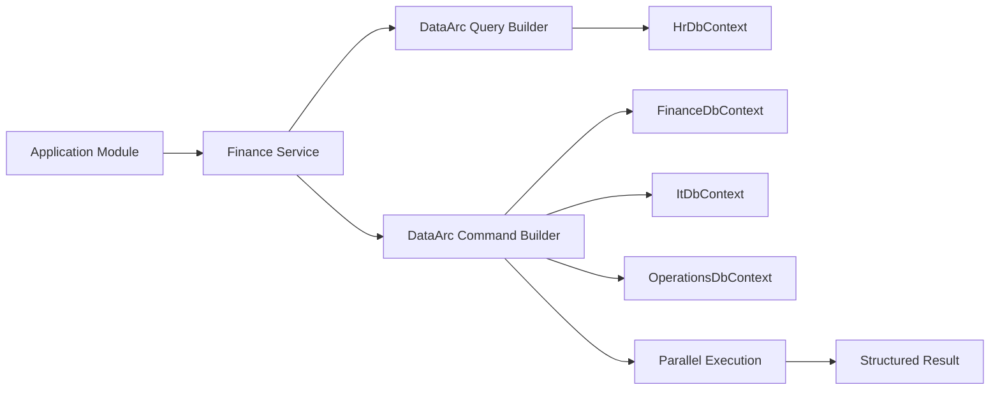

The demo focuses on the core DataArc value:

```text
Define the workflow.
Build the command pipeline.
Execute across context boundaries.
Receive a structured result.
```

---

## Project Structure

The demo separates application and persistence concerns.

```text
DataArc.EntityFrameworkCore.Demo
│
├── Application
│   └── Modules
│       └── Finance
│           ├── Features
│           │   └── SalaryAdjustments
│           │       └── Dtos
│           │           └── EmployeeDto.cs
│           ├── Registration
│           │   └── FinanceModuleRegistration.cs
│           └── Services
│               ├── FinanceService.cs
│               └── IFinanceService.cs
│
├── Persistence
│   └── Database
│       ├── DBContexts
│       │   ├── FinanceDbContext.cs
│       │   ├── HrDbContext.cs
│       │   ├── ItDbContext.cs
│       │   └── OperationsDbContext.cs
│       ├── DBModels
│       │   ├── Employee.cs
│       │   └── Employer.cs
│       └── Seeding
│           ├── DatabaseCreator.cs
│           ├── DatabaseSeeder.cs
│           └── SeedDataGenerator.cs
│
├── PersistenceRegistration.cs
└── Program.cs
```

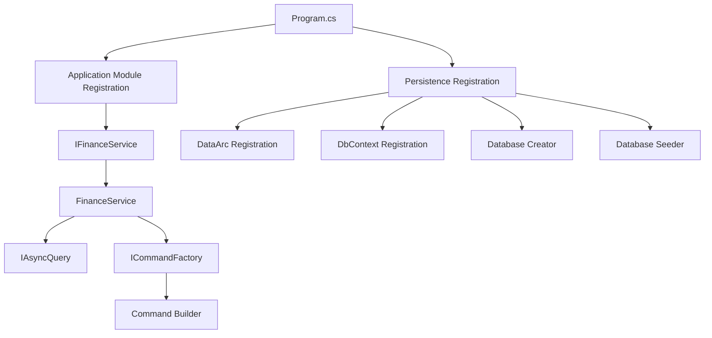

The application module does not need to know how the database is created, seeded, or registered.

The persistence layer owns EF Core contexts, database models, schema setup, seeding, and DataArc execution context registration.

---

# Demo Workflow

## Salary Adjustment Scenario

The finance service performs a practical multi-context workflow:

```text
1. Query employees from HR.
2. Apply salary adjustment rules.
3. Bulk write adjusted employee data into Finance.
4. Bulk write adjusted employee data into IT.
5. Bulk write adjusted employee data into Operations.
6. Execute those writes in parallel.
7. Return updated employee DTOs.
```

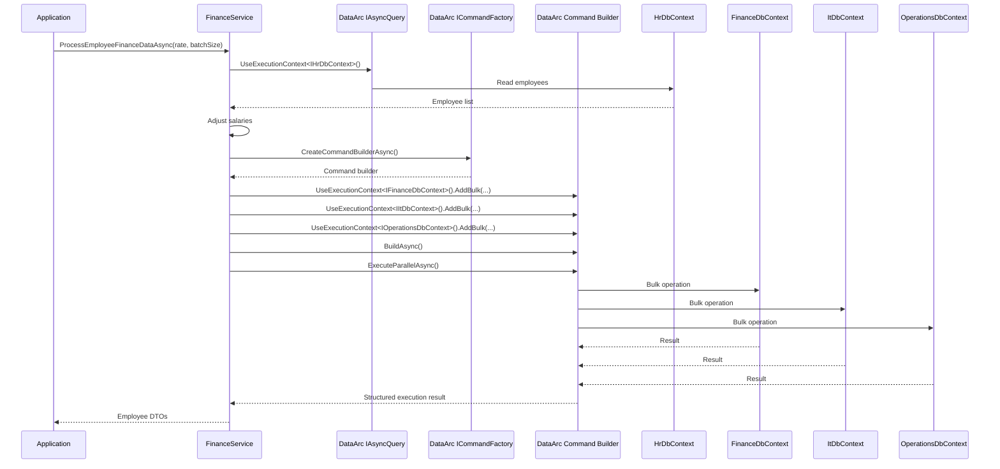

---

## Core Code Shape

Application services inject `ICommandFactory` as the command entry point. They create the required command or command builder inside the workflow instead of injecting a specific builder type at construction time.

The demo reads employees from one context:

```csharp
var employeesQuery = await _asyncQuery
    .UseExecutionContext<IHrDbContext>()
        .ReadWhereAsync<Employee>(e => e.Salary > 10000m);
```

It then builds a command pipeline across multiple contexts:

```csharp
var commandBuilder = await _commandFactory.CreateCommandBuilderAsync();

commandBuilder
    .UseExecutionContext<IFinanceDbContext>()
        .AddBulk(employeesQuery, batchSize);

commandBuilder
    .UseExecutionContext<IItDbContext>()
        .AddBulk(employeesQuery, batchSize);

commandBuilder
    .UseExecutionContext<IOperationsDbContext>()
        .AddBulk(employeesQuery, batchSize);
```

Then it builds and executes the pipeline in parallel:

```csharp
var command = await commandBuilder.BuildAsync();

var commandResult = await command.ExecuteParallelAsync();

if (!commandResult.Success)
{
    throw new InvalidOperationException(
        $"Failed to process salary adjustments. {commandResult?.Exception?.Message}");
}
```

---

# DataArc Registration

Each EF Core context remains a normal `DbContext`.

DataArc treats each registered context as an execution boundary.

```csharp
services
    .AddDataArcCore()
    .UseEntityFrameworkCoreProviders(provider =>
    {
        provider.ConfigureExecutionContexts(ctx =>
        {
            ctx.AddDbContext<IFinanceDbContext, FinanceDbContext>(options =>
                options.UseSqlServer(financeConnectionString));

            ctx.AddDbContext<IHrDbContext, HrDbContext>(options =>
                options.UseSqlServer(hrConnectionString));

            ctx.AddDbContext<IItDbContext, ItDbContext>(options =>
                options.UseSqlServer(itConnectionString));

            ctx.AddDbContext<IOperationsDbContext, OperationsDbContext>(options =>
                options.UseSqlServer(operationsConnectionString));
        });
    });
```

Each context implements the DataArc execution context contract:

```csharp
public interface IFinanceDbContext : IExecutionContext<FinanceDbContext>
{
}

public class FinanceDbContext 
    : DbContext, IFinanceDbContext
{
    public FinanceDbContext(DbContextOptions<FinanceDbContext> options)
        : base(options)
    {
    }

    public DbSet<Employer> Employer { get; set; }
    public DbSet<Employee> Employee { get; set; }
}
```

---

# Database Setup

The demo also shows DataArc schema/database coordination through `IDatabaseFactory`.

```csharp
var databaseBuilder = _databaseFactory.CreateDatabaseBuilder();

var db = databaseBuilder
    .UseContext<IFinanceDbContext>()
    .UseContext<IHrDbContext>()
    .UseContext<IItDbContext>()
    .UseContext<IOperationsDbContext>()
    .Build(applyChanges: true, generateScripts: true);

db.ExecuteDrop();
db.ExecuteCreate();
```

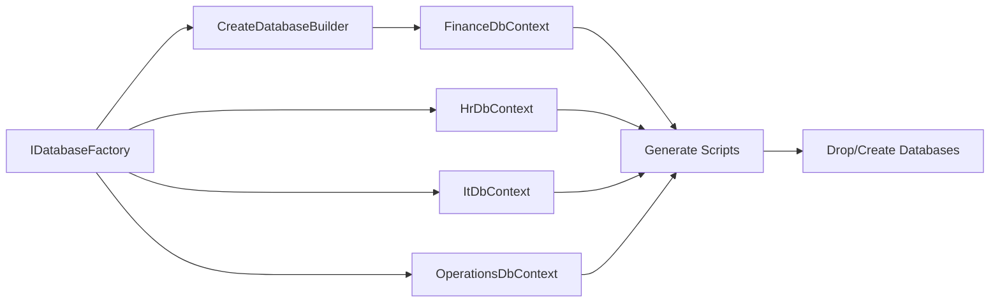

---

# Benchmark Snapshot

The demo includes a BenchmarkDotNet benchmark that measures parallel bulk insert execution across four EF Core persistence boundaries:

- `HrDbContext`
- `FinanceDbContext`
- `ItDbContext`
- `OperationsDbContext`

Each benchmark run inserts the configured `RecordCount` into all four participating contexts.

```text
RecordCount = 250,000
Participating DbContexts = 4
Total inserted records = 1,000,000
```

The benchmark is intentionally focused on the execution layer. It builds one DataArc command pipeline and executes the work in parallel across all registered context boundaries.

```csharp
var commandBuilder = await _commandFactory.CreateCommandBuilderAsync();

commandBuilder.UseExecutionContext<IHrDbContext>().AddBulk(_employees, BulkBatchSize);
commandBuilder.UseExecutionContext<IFinanceDbContext>().AddBulk(_employees, BulkBatchSize);
commandBuilder.UseExecutionContext<IItDbContext>().AddBulk(_employees, BulkBatchSize);
commandBuilder.UseExecutionContext<IOperationsDbContext>().AddBulk(_employees, BulkBatchSize);

var command = await commandBuilder.BuildAsync();
var commandResult = await command.ExecuteParallelAsync();
```

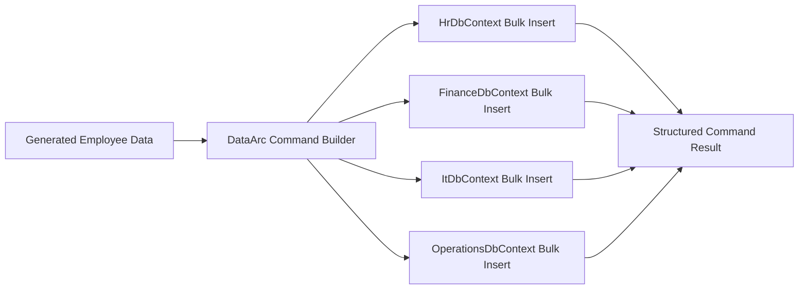

## Benchmark Environment

```text
BenchmarkDotNet v0.15.8
OS: Windows 11 25H2 / 2025 Update
CPU: 13th Gen Intel Core i7-13700H 2.40GHz
Cores: 14 physical, 20 logical
.NET SDK: 10.0.300
Runtime: .NET 8.0.27
JIT: RyuJIT x64
InvocationCount: 1
IterationCount: 4
WarmupCount: 1
UnrollFactor: 1
Diagnosers: MemoryDiagnoser, ThreadingDiagnoser
```

## Benchmark Results

| Method | Record Count | Total Inserted Records | Mean | StdDev | Completed Work Items | Lock Contentions | Gen0 | Allocated |
|---|---:|---:|---:|---:|---:|---:|---:|---:|
| ExecuteParallelBulkInsertAsync | 10,000 | 40,000 | 193.7 ms | 4.16 ms | 2,952 | - | - | 10.04 MB |
| ExecuteParallelBulkInsertAsync | 100,000 | 400,000 | 657.2 ms | 77.40 ms | 30,844 | - | - | 97.02 MB |
| ExecuteParallelBulkInsertAsync | 250,000 | 1,000,000 | 2,350.7 ms | 52.27 ms | 78,184 | - | 10,000 | 242.4 MB |

## Benchmark Trend

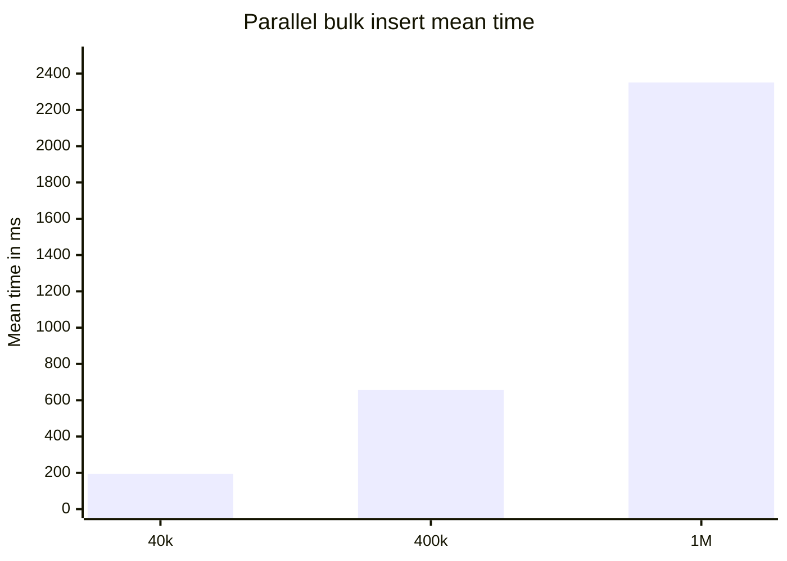

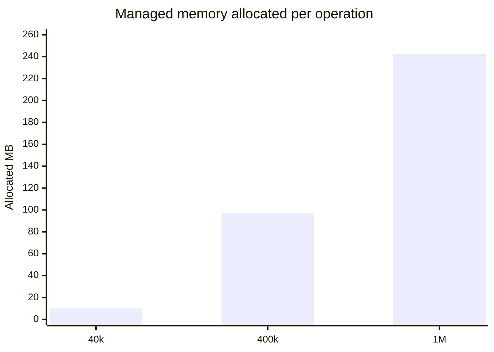

## What This Shows

At the largest measured size in this demo benchmark, DataArc.EntityFrameworkCore inserted 1,000,000 total records across four participating EF Core contexts in approximately 2.35 seconds, allocating approximately 242 MB of managed memory for the operation.

The useful engineering signal is not only the elapsed time. The stronger signal is that the workload is executed through a single explicit command pipeline, across multiple context boundaries, with structured success/failure reporting and no reported lock contentions in this run.

## Benchmark Notes

These results are workload-specific evidence, not a universal performance guarantee.

Results depend on:

- hardware
- database provider
- database location
- schema shape
- entity size
- indexes
- batch size
- relationship graph complexity
- runtime version
- database state before each iteration
- transaction behavior

The benchmark resets the participating databases during iteration setup, generates fresh employee data for each `RecordCount`, builds the DataArc command pipeline, executes it in parallel, and returns the total affected record count.
---

# Why Add DataArc.EntityFrameworkCore To Your Engineering Toolkit?

## 1. It Preserves Modular EF Core Boundaries

Many real systems use one normalized database while still needing separate logical EF Core boundaries.

```text
IdentityContext
ProductsContext
PackagingContext
LicensingContext
PricingContext
IntersectionContext
AuditContext
```

Normal EF Core works well inside one context. The pain starts when workflows must cross context boundaries.

DataArc lets teams preserve modular context boundaries without collapsing everything into one giant `DbContext`.

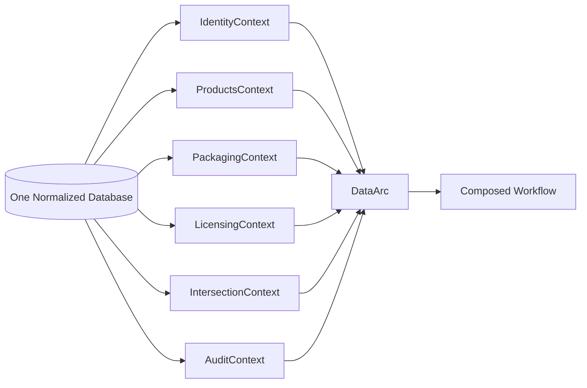

---

## 2. It Gives Cross-Context Workflows A Real Execution Model

Real workflows often need data from multiple persistence boundaries:

- identity + licensing
- products + packages
- pricing + entitlements
- audit + activations
- HR + finance + operations

DataArc gives those workflows a C# execution model across contexts.

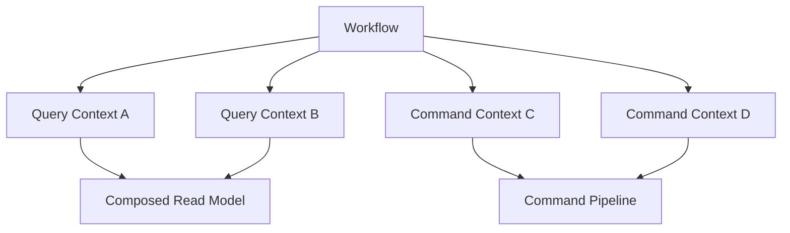

---

## 3. It Supports Coordinated Parallel Operations

Normal EF Core can run multiple `DbContext` instances in parallel when each path has its own context instance and lifecycle.

The developer still has to manage:

- context creation
- disposal
- transaction behavior
- `Task.WhenAll`
- exception handling
- rollback handling
- result aggregation

DataArc turns this into a command pipeline:

```csharp
var commands = await commandBuilder
    .UseExecutionContext<IFinanceDbContext>()
        .AddBulk(financeEmployees, batchSize)
    .UseExecutionContext<IItDbContext>()
        .AddBulk(itEmployees, batchSize)
    .UseExecutionContext<IOperationsDbContext>()
        .AddBulk(operationsEmployees, batchSize)
    .BuildAsync();

var result = await commands.ExecuteParallelAsync();
```

---

## 4. It Separates Reads From Writes At The Execution Layer

DataArc separates reads and writes through dedicated query and command APIs.

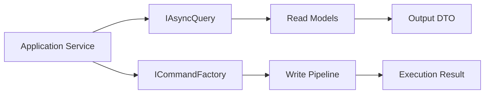

This gives teams CQRS-style execution discipline at the persistence layer without forcing every operation into a request/handler class.

---

## 5. It Reduces Repository-Per-Table Sprawl

A repository-per-table design can grow quickly:

```text
UserRepository
ProductRepository
PackageRepository
LicenseRepository
UserLicenseRepository
UserProductRepository
ActivationRepository
ProductPackageRepository
```

The workflow still needs to stitch those repositories together.

DataArc lets teams compose directly against known EF Core context boundaries through command/query builders.

```text
DbContexts are persistence boundaries.
DataArc is the execution layer.
Orchestrators are workflow boundaries.
```

Repositories can still be used where they add value.

The point is that DataArc gives teams another option when repository coordination becomes the problem.

---

## 6. It Reduces Handler, Query, And Command Permutation Sprawl

Handler-heavy designs can multiply for small data access variations:

```text
GetUserByEmailQuery
GetUserByAccessFailedCountQuery
GetEmailByUserIdQuery
UpdateEmailConfirmedCommand
CreateUserCommand
DeleteUserCommand
```

DataArc reduces the need to create a separate handler, query, command, and repository method for every small data access variation.

The operation can be expressed directly through the persistence execution layer.

---

## 7. It Supports Cross-Context Read Models

DataArc supports cross-context read model composition using a bag pattern.

Each join adds data to the bag. The final projection creates a workflow-specific read model.

```csharp
var rows = await asyncQuery
    .UseExecutionContext<IIntersectionContext, UserProduct>(x => x.UserId == userId)
    .Join<ProductsContext, Product>(
        bag => bag.Get<UserProduct>()!.ProductId,
        product => product.Id)
    .Join<PackagingContext, Package>(
        bag => bag.Get<Product>()!.PackageId,
        package => package.Id)
    .Select(bag => new ProductPackageRow
    {
        ProductName = bag.Get<Product>()!.Name,
        PackageName = bag.Get<Package>()!.Name
    })
    .ToListAsync();
```

This is useful when a read model spans multiple context boundaries.

---

## 8. It Improves Observability Through Structured Results

Normal EF Core workflows often repeat:

- try/catch logic
- transaction handling
- logging
- timing
- failure reporting
- result mapping

DataArc wraps execution in structured results:

```csharp
var result = await command.CommitTransactionAsync();

if (!result.Success)
{
    logger.LogError(result.Exception, "Command failed.");
    return;
}
```

DataArc results are designed to support:

- success/failure
- exception details
- per-context reporting
- overall execution reporting
- logging-friendly outcomes
- transaction-safe command flows
- performance visibility

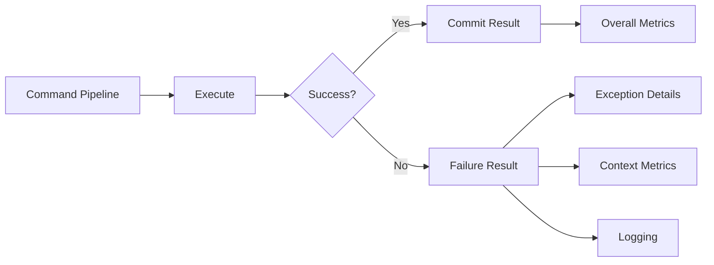

---

## 9. It Is Built For High-Volume Scheduled Workloads

Many systems run large data operations on a schedule:

```text
Month-end billing
Year-end processing
License renewals
Entitlement recalculation
Product imports
Customer migrations
Reconciliation jobs
Audit/archive jobs
Activation sweeps
Tenant provisioning
Reporting snapshots
```

These jobs may not run every minute. When they run, they affect memory, CPU, database load, deployment sizing, and cost.

DataArc is built for those moments.

---

## 10. It Gives EF Core A Path From Simple CRUD To Database Orchestration

Use `DbContext` directly when the operation is simple and stays inside one persistence boundary.

```csharp
dbContext.Set<Employee>().Add(employee);
await dbContext.SaveChangesAsync();
```

Use DataArc.EntityFrameworkCore when the workflow needs:

- multiple contexts
- bulk operations
- parallel execution
- structured execution results
- context switching
- cross-context read models
- transaction-safe command flows
- logging and performance visibility

```text
DbContext is excellent inside one persistence boundary.
DataArc coordinates execution across boundaries.
```

---

# Why Not Just Use DbContext?

Use `DbContext` directly when the operation is simple and stays inside one persistence boundary.

DataArc becomes valuable when the workflow needs more than a single-context unit of work.

```text
Direct DbContext for simple persistence.
DataArc for coordinated execution.
```

---

# Why Not Repositories?

Repositories are still valid.

DataArc does not require teams to abandon repositories.

The pain DataArc addresses is repository coordination sprawl, where a service starts juggling many repositories, context boundaries, transactions, bulk operations, and results.

DataArc can live under repositories, inside services, or inside orchestrators.

---

# Why Not MediatR?

MediatR dispatches messages to handlers.

DataArc coordinates EF Core execution across persistence boundaries.

DataArc gives command/query separation at the database execution level without forcing a request/handler class for every small operation.

---

# Why Not Bulk Libraries?

Bulk libraries are useful when the task is one isolated bulk operation.

DataArc focuses on bulk operations inside broader execution workflows:

- context boundaries
- command pipelines
- parallel execution
- transaction handling
- structured results
- performance visibility

---

# Where Orchestrators Fit

DataArc.EntityFrameworkCore can be used directly in services, as this demo shows.

When workflows become larger, they need a dedicated home.

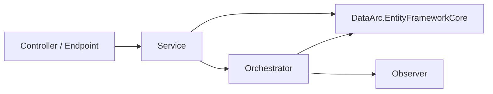

## Database Orchestration Needs A Home

For simple workflows, use DataArc.EntityFrameworkCore directly.

For larger workflows, move the workflow into **DataArc.Orchestrator**.

For post-execution outcomes, use **DataArc.Observer**.

```text
DataArc.EntityFrameworkCore
    ↓
Database Orchestration Needs A Home
    ↓
DataArc.Orchestrator
    ↓
DataArc.Observer
```

---

# Running The Demo

## 1. Configure Connection Strings

Update the SQL Server connection strings in `PersistenceRegistration.cs`.

```csharp
ctx.AddDbContext<FinanceDbContext>(options =>
    options.UseSqlServer("Server=YOUR_SERVER;Database=FinanceDb;Integrated Security=true;TrustServerCertificate=True;"));

ctx.AddDbContext<HrDbContext>(options =>
    options.UseSqlServer("Server=YOUR_SERVER;Database=HrDb;Integrated Security=true;TrustServerCertificate=True;"));

ctx.AddDbContext<ItDbContext>(options =>
    options.UseSqlServer("Server=YOUR_SERVER;Database=ItDb;Integrated Security=true;TrustServerCertificate=True;"));

ctx.AddDbContext<OperationsDbContext>(options =>
    options.UseSqlServer("Server=YOUR_SERVER;Database=OperationsDb;Integrated Security=true;TrustServerCertificate=True;"));
```

## 2. Run The Application

```bash
dotnet run
```

The application will:

1. Delete existing demo databases.
2. Create demo databases.
3. Seed HR data.
4. Run the finance salary adjustment workflow.
5. Bulk distribute adjusted employee data into Finance, IT, and Operations.
6. Print the number of processed employees.

---

# Trial Path

DataArc.EntityFrameworkCore is intended to support a 7-day trial so teams can test real workloads before purchasing.

Use the trial to validate:

- modular context boundaries
- cross-context queries
- command pipelines
- bulk operations
- scheduled workload behavior
- logging and execution reporting

---

# Summary

DataArc.EntityFrameworkCore gives EF Core a deterministic execution layer for modular, high-throughput, multi-context systems.

It helps teams:

- preserve modular context boundaries
- compose cross-context workflows
- execute coordinated command pipelines
- run parallel operations
- reduce repository and handler sprawl
- build cross-context read models
- run bulk workloads with lower memory pressure
- return structured execution results
- log and measure workflow execution

Most architectures define structure.

**DataArc controls execution.**
