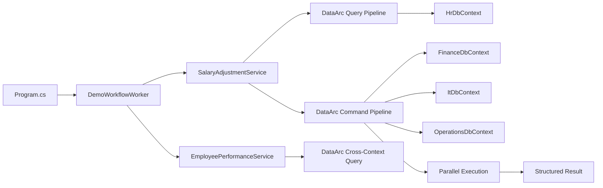
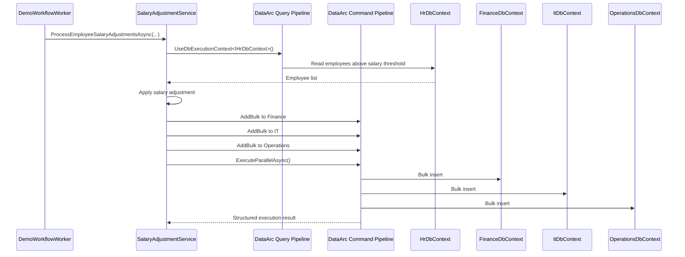
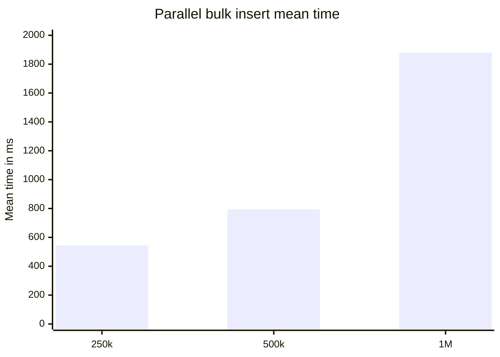

# DataArc.EntityFrameworkCore

> EF Core execution for background workers, batch jobs, bulk operations, cross-context reads, parallel writes, and structured results.

**DataArc.EntityFrameworkCore** uses EF Core.

It provides a dedicated execution layer that helps application code coordinate serious EF Core data workflows across multiple `DbContext` boundaries without turning the workflow into scattered repository calls, handler classes, one-off bulk extensions, or manual `DbContext` plumbing.

This demo runs as a small .NET background worker.

The worker executes a finance-style data workflow:

```text
Read employees from HR.
Apply salary adjustment rules.
Bulk write the adjusted data into Finance, IT, and Operations.
Query the resulting data across all four contexts.
Return structured execution results.
```

---

## What DataArc Adds To EF Core

The demo proves four practical things:

1. **Explicit execution boundaries**  
   Application code chooses which EF Core boundary should execute the work.

2. **Parallel bulk writes**  
   One command pipeline writes to multiple EF Core contexts in parallel.

3. **Cross-context reads**  
   One query pipeline can compose a read model across multiple contexts.

4. **Structured results**  
   Command execution returns success or failure, affected records, and exception detail in one result shape.

The central idea:

```text
Use EF Core.
Keep DbContexts isolated.
Choose execution boundaries explicitly.
Build command/query pipelines.
Execute the workflow.
Receive structured results.
```

A .NET `BackgroundService` gives the workflow a familiar home.

DataArc.EntityFrameworkCore gives the workflow its execution model.

---

## Benchmark Snapshot

The benchmark inserts employee records into four EF Core contexts:

- `HrDbContext`
- `FinanceDbContext`
- `ItDbContext`
- `OperationsDbContext`

Each benchmark case inserts `RecordCount` employees into each participating context.

```text
Total inserted records = RecordCount x 4
```

| Method | Record Count Per Context | Total Inserted Records | Mean | StdDev | Completed Work Items | Lock Contentions | Gen0 | Allocated |
|---|---:|---:|---:|---:|---:|---:|---:|---:|
| ExecuteParallelBulkInsertAsync | 62,500 | 250,000 | 543.5 ms | 43.35 ms | 19,109 | - | 5,000 | 60.73 MB |
| ExecuteParallelBulkInsertAsync | 125,000 | 500,000 | 793.7 ms | 123.56 ms | 38,686 | - | 10,000 | 121.25 MB |
| ExecuteParallelBulkInsertAsync | 250,000 | 1,000,000 | 1,879.3 ms | 194.56 ms | 77,531 | - | 20,000 | 242.11 MB |

These results are workload-specific evidence, not a universal performance guarantee. Hardware, SQL Server configuration, schema shape, indexes, batch size, runtime version, and database state all affect results.

The useful signal is the execution shape: one explicit command pipeline, four EF Core contexts, parallel execution, structured result handling, and no reported lock contentions in this run.

---

## Why DataArc.EntityFrameworkCore Exists

EF Core is excellent inside one `DbContext`.

Many systems eventually need data workflows that move beyond one direct context call:

- read from one database and write to another
- import data into multiple tables or contexts
- synchronize data between operational stores
- build reporting or workflow projections
- reconcile data across multiple persistence boundaries
- bulk process scheduled jobs
- compose read models from more than one EF Core context

Plain EF Core does not provide native high-throughput bulk insert as a first-class API.

Third-party bulk libraries can add bulk methods to a `DbContext`, although they do not provide a full execution pipeline across multiple EF Core context boundaries.

DataArc.EntityFrameworkCore provides the coordination layer: command/query pipelines, explicit execution contexts, parallel execution, affected-record aggregation, failure handling, and structured results.

It is designed for EF Core work that needs:

- isolated context boundaries
- command/query separation
- bulk operations
- parallel execution
- cross-context reads
- structured execution results
- transaction-aware command flows
- logging-friendly outcomes
- high-volume scheduled jobs
- predictable workflow execution

Small CRUD applications can often be scaffolded, generated, and maintained with standard EF Core patterns.

DataArc.EntityFrameworkCore adds the most value when the data work becomes coordinated: multiple boundaries, larger data movement, repeatable workflows, clear execution results, and predictable success or failure reporting.

The value is giving EF Core work an explicit execution model.

---

## Demo Workflow

The demo uses four isolated EF Core persistence boundaries:

```text
HrDbContext
FinanceDbContext
ItDbContext
OperationsDbContext
```

The application flow:

1. Deletes existing demo databases.
2. Creates the demo databases.
3. Generates SQL scripts for the database operations.
4. Seeds employee data into HR.
5. Starts a .NET hosted worker.
6. Reads employees from HR.
7. Applies salary adjustment rules.
8. Bulk writes adjusted data into Finance, IT, and Operations.
9. Executes the command pipeline in parallel.
10. Queries top-rated employees across all four contexts.
11. Prints a short summary.
12. Stops the host after the workflow completes.



---

## Application Shape

The demo uses the .NET generic host.

`Program.cs` configures the generic host, registers the hosted worker, initializes the demo databases, and starts the host. The hosted worker runs the actual data workflow.

```text
Program.cs = host setup + startup flow
DemoDatabaseInitializer = demo database reset, create, and seed
DemoWorkflowWorker = background data workflow runner
SalaryAdjustmentService = read-transform-write workflow
EmployeePerformanceService = cross-context read model
Persistence = EF Core contracts, contexts, registration, database creation, seeding, and initialization
```

This shape is familiar to .NET developers because many real data workflows run as background jobs, scheduled workers, import/export processors, reconciliation jobs, reporting projection builders, or internal batch processes.

```csharp
var host = Host
    .CreateDefaultBuilder(args)
    .ConfigureServices(services =>
    {
        var configurationManager = new ConfigurationManager();

        configurationManager
            .AddJsonFile("appsettings.json", optional: false)
            .Build();

        services
            .AddFinanceModule(configurationManager)
            .AddHostedService<DemoWorkflowWorker>();
    })
    .Build();

using var scope = host.Services.CreateScope();

await DemoDatabaseInitializer.InitializeAsync(scope.ServiceProvider);

await host.RunAsync();

Console.WriteLine();
Console.WriteLine("Press any key to exit.");
Console.ReadKey();
```

The database setup detail belongs in persistence. The workflow execution detail belongs inside the worker and use-case services, not in `Program.cs`.

---

## Demo Database Initialization

`DemoDatabaseInitializer` lives in the persistence project because database reset, creation, script generation, and seeding are persistence setup concerns.

`Program.cs` decides when the demo initialization runs. The persistence project owns how it runs.

The initializer coordinates the individual database creators and seeders:

```text
FinanceDbCreator
HrDbCreator
ItDbCreator
OperationsDbCreator
HrDbSeeder
```

Keeping the creators separate makes the setup easier to read, easier to test, and easier to troubleshoot. The more advanced database builder composition is still available, although this demo introduces database creation one database at a time for lower-friction adoption.

---

## Background Worker

`DemoWorkflowWorker` calls the application services that use DataArc.EntityFrameworkCore.

```csharp
internal sealed class DemoWorkflowWorker : BackgroundService
{
    private const int BatchSize = 100_000;

    private readonly ISalaryAdjustmentService _salaryAdjustmentService;
    private readonly IEmployeePerformanceService _employeePerformanceService;
    private readonly IHostApplicationLifetime _hostApplicationLifetime;

    public DemoWorkflowWorker(
        ISalaryAdjustmentService salaryAdjustmentService,
        IEmployeePerformanceService employeePerformanceService,
        IHostApplicationLifetime hostApplicationLifetime)
    {
        _salaryAdjustmentService = salaryAdjustmentService;
        _employeePerformanceService = employeePerformanceService;
        _hostApplicationLifetime = hostApplicationLifetime;
    }

    protected override async Task ExecuteAsync(CancellationToken stoppingToken)
    {
        try
        {
            var processedCount = await _salaryAdjustmentService
                .ProcessEmployeeSalaryAdjustmentsAsync(
                    salaryAdjustmentBaseRate: 0.05m,
                    salaryThreshold: 10_000m,
                    batchSize: BatchSize);

            Console.WriteLine($"Processed salary adjustment records: {processedCount:N0}");

            if (processedCount > 0)
            {
                var topRatedEmployees = await _employeePerformanceService
                    .GetTopRatedEmployeesAsync(rating: 4.5);

                var topRatedEmployee = topRatedEmployees
                    .OrderByDescending(employee => employee.Salary)
                    .FirstOrDefault();

                Console.WriteLine();

                Console.WriteLine(topRatedEmployee is null
                    ? "No top rated employees found."
                    : $"Top Rated Employee: {topRatedEmployee.Name} {topRatedEmployee.Surname}, " +
                      $"Salary: {topRatedEmployee.Salary:N2}, " +
                      $"Number of top rated employees: {topRatedEmployees.Count:N0}");
            }

            Console.WriteLine();
            Console.WriteLine("Demo workflow completed.");
        }
        finally
        {
            _hostApplicationLifetime.StopApplication();
        }
    }
}
```

The worker is intentionally thin. It runs the workflow and leaves EF Core execution details inside the application services.

---

## Salary Adjustment Use Case

`SalaryAdjustmentService` reads from HR, applies the adjustment, then writes to three target contexts through one command pipeline.



Core shape:

```csharp
var employeesQuery = await _queryFactory.CreateQueryAsync();

var employees = await employeesQuery
    .UseDbExecutionContext<IHrDbContext>()
        .ReadWhereAsync<Employee>(employee => employee.Salary > salaryThreshold);

foreach (var employee in employees)
{
    employee.Salary += employee.Salary * salaryAdjustmentBaseRate;
}

var commandBuilder = await _commandFactory.CreateCommandBuilderAsync();

commandBuilder
    .UseDbExecutionContext<IFinanceDbContext>()
        .AddBulk(employees, batchSize);

commandBuilder
    .UseDbExecutionContext<IItDbContext>()
        .AddBulk(employees, batchSize);

commandBuilder
    .UseDbExecutionContext<IOperationsDbContext>()
        .AddBulk(employees, batchSize);

var command = await commandBuilder.BuildAsync();
var commandResult = await command.ExecuteParallelAsync();

if (!commandResult.Success)
{
    throw new InvalidOperationException(
        $"Failed to process salary adjustments. {commandResult.Exception?.Message}");
}

return commandResult.TotalAffected;
```

The repeated `UseDbExecutionContext<T>()` calls are intentional. Each target is explicit, visible, and independently routed.

---

## Cross-Context Query Use Case

`EmployeePerformanceService` demonstrates a cross-context read model.

It starts from HR employees above a rating threshold, joins related employees across Finance, IT, and Operations, then projects the result into a DTO.

```csharp
var topRatedEmployeesQuery = await _queryFactory.CreateQueryAsync();

var topRatedEmployees = await topRatedEmployeesQuery
    .UseDbExecutionContext<IHrDbContext, Employee>(employee => employee.Rating > rating)
        .Join<IFinanceDbContext, Employee>(
            bag => bag.Get<Employee>()!.Id,
            financeEmployee => financeEmployee.Id)
        .Join<IItDbContext, Employee>(
            bag => bag.Get<Employee>()!.Id,
            itEmployee => itEmployee.Id)
        .Join<IOperationsDbContext, Employee>(
            bag => bag.Get<Employee>()!.Id,
            operationsEmployee => operationsEmployee.Id)
    .Select(bag => new EmployeeDto
    {
        Id = bag.Get<Employee>()!.Id,
        Name = bag.Get<Employee>()!.Name!,
        Surname = bag.Get<Employee>()!.Surname!,
        Salary = bag.Get<Employee>()!.Salary
    })
    .ToListAsync();
```

This creates one read model from multiple isolated EF Core contexts without exposing the concrete `DbContext` implementations to application code.

---

## Public Execution Contracts, Internal DbContexts

The demo exposes each EF Core boundary through a public execution-context contract.

Application code depends on these contracts, not on the concrete `DbContext` implementations.

The contracts define the DataArc execution boundaries and expose the EF Core sets available through those boundaries.

```csharp
public interface IFinanceDbContext : IExecutionContext
{
    DbSet<Employer>? Employer { get; set; }

    DbSet<Employee>? Employee { get; set; }
}
```

The concrete `DbContext` implementation remains internal to the persistence project:

```csharp
internal class FinanceDbContext : DbContext, IFinanceDbContext
{
    public FinanceDbContext(DbContextOptions<FinanceDbContext> dbContextOptions)
        : base(dbContextOptions)
    {
    }

    public DbSet<Employer>? Employer { get; set; }

    public DbSet<Employee>? Employee { get; set; }

    protected override void OnModelCreating(ModelBuilder modelBuilder)
    {
        base.OnModelCreating(modelBuilder);

        modelBuilder
            .Entity<Employer>()
            .Property(employer => employer.Description)
            .HasColumnType("text");
    }
}
```

DataArc uses the public execution contract to route work to the registered EF Core implementation:

```csharp
commandBuilder
    .UseDbExecutionContext<IFinanceDbContext>()
        .AddBulk(employees, batchSize);
```

This keeps the concrete EF Core implementation hidden while giving the application a clear execution boundary to target.

---

## DataArc Registration

Each EF Core context is registered as a DataArc database execution context.

This demo uses SQL Server.

The worker and application services do not configure SQL Server directly. They target DataArc execution contexts. SQL Server connection strings and EF Core provider configuration stay in `PersistenceRegistration.cs`.

```csharp
services.AddDataArcCore();

services.ConfigureDataArc(dataArc =>
{
    dataArc.UseEntityFrameworkCore(ef =>
    {
        ef.AddDbExecutionContext<IFinanceDbContext, FinanceDbContext>(options =>
            options.UseSqlServer(financeConnectionString));

        ef.AddDbExecutionContext<IHrDbContext, HrDbContext>(options =>
            options.UseSqlServer(hrConnectionString));

        ef.AddDbExecutionContext<IItDbContext, ItDbContext>(options =>
            options.UseSqlServer(itConnectionString));

        ef.AddDbExecutionContext<IOperationsDbContext, OperationsDbContext>(options =>
            options.UseSqlServer(operationsConnectionString));
    });
});
```

The registration tells DataArc:

```text
This contract is the execution boundary.
This concrete DbContext is the EF Core implementation.
This connection string points to the SQL Server database.
```

---

## Database Creation Without EF Core Migration Files

The demo does not use EF Core migration files.

Each database has its own familiar creator:

```text
FinanceDbCreator
HrDbCreator
ItDbCreator
OperationsDbCreator
```

Each creator implements EF Core's `IDatabaseCreator` shape and uses DataArc's database builder to create its database from the current `DbContext` model.

Example:

```csharp
public class FinanceDbCreator : IFinanceDbCreator
{
    private readonly IDatabaseFactory _databaseFactory;

    public FinanceDbCreator(IDatabaseFactory databaseFactory)
    {
        _databaseFactory = databaseFactory;
    }

    public bool EnsureCreated()
    {
        var dbBuilder = _databaseFactory.CreateDatabaseBuilder();

        var db = dbBuilder
            .IncludeDbContext<FinanceDbContext>()
            .Build(generateScripts: true, applyChanges: true);

        db.ExecuteCreate();

        return true;
    }

    public bool EnsureDeleted()
    {
        var dbBuilder = _databaseFactory.CreateDatabaseBuilder();

        var db = dbBuilder
            .IncludeDbContext<FinanceDbContext>()
            .Build(generateScripts: true, applyChanges: true);

        db.ExecuteDrop();

        return true;
    }
}
```

EF Core's `EnsureCreated()` can create a database from a model. DataArc's builder adds reviewable script generation without requiring EF Core migration files in this demo.

Generated SQL scripts are written to the app output directory under `Scripts`.

Example:

```text
bin/Debug/net8.0/Scripts
```

The generated scripts include database creation, schema creation, table creation, and constraints.

```sql
CREATE DATABASE [FinanceDb];
GO

USE [FinanceDb];
GO

IF SCHEMA_ID('employees') IS NULL EXEC('CREATE SCHEMA [employees]');
GO

CREATE TABLE [employees].[Employees] (
    [Id] int IDENTITY(1,1) NOT NULL,
    [EmployeeName] varchar(50) NULL,
    [EmployeeSalary] decimal(33,2) NOT NULL,
    PRIMARY KEY ([Id])
);
GO
```

---

## Project Structure

```text
DataArc.EntityFrameworkCore.Demo
│
├── Application
│   ├── Modules
│   │   └── Finance
│   │       ├── Features
│   │       │   ├── SalaryAdjustments
│   │       │   │   ├── Dtos
│   │       │   │   │   └── EmployeeDto.cs
│   │       │   │   └── Services
│   │       │   │       ├── ISalaryAdjustmentService.cs
│   │       │   │       └── SalaryAdjustmentService.cs
│   │       │   └── EmployeePerformance
│   │       │       └── Services
│   │       │           ├── IEmployeePerformanceService.cs
│   │       │           └── EmployeePerformanceService.cs
│   │       └── Registration
│   │           └── FinanceModuleRegistration.cs
│   └── Workers
│       └── DemoWorkflowWorker.cs
│
├── Persistence
│   ├── DemoDatabaseInitializer.cs
│   ├── Contracts
│   │   ├── IFinanceDbContext.cs
│   │   ├── IHrDbContext.cs
│   │   ├── IItDbContext.cs
│   │   └── IOperationsDbContext.cs
│   ├── Database
│   │   ├── Creator
│   │   │   ├── FinanceDbCreator.cs
│   │   │   ├── HrDbCreator.cs
│   │   │   ├── ItDbCreator.cs
│   │   │   └── OperationsDbCreator.cs
│   │   ├── DbContexts
│   │   │   ├── FinanceDbContext.cs
│   │   │   ├── HrDbContext.cs
│   │   │   ├── ItDbContext.cs
│   │   │   └── OperationsDbContext.cs
│   │   ├── DbModels
│   │   │   ├── Employee.cs
│   │   │   └── Employer.cs
│   │   └── Seeder
│   │       ├── HrDbSeeder.cs
│   │       └── SeedDataGenerator.cs
│   └── PersistenceRegistration.cs
│
└── Program.cs
```

The application project owns the worker and use-case services.

The persistence project owns EF Core contracts, contexts, database models, database creation, seeding, and DataArc registration.

The demo application and benchmark project both reference the persistence project directly.

```text
DataArc.EntityFrameworkCore.Demo
    -> DataArc.EntityFrameworkCore.Demo.Persistence

DataArc.EntityFrameworkCore.Demo.Benchmark
    -> DataArc.EntityFrameworkCore.Demo.Persistence
```

The benchmark references the persistence project directly so it measures the DataArc EF Core execution path without depending on the demo application shell.

---

## Running The Demo

### 1. Configure Connection Strings

Update the SQL Server connection strings in `appsettings.json`.

```json
{
  "ConnectionStrings": {
    "FinanceDb": "Server=YOUR_SERVER;Database=FinanceDb;Integrated Security=true;TrustServerCertificate=True;",
    "HrDb": "Server=YOUR_SERVER;Database=HrDb;Integrated Security=true;TrustServerCertificate=True;",
    "ItDb": "Server=YOUR_SERVER;Database=ItDb;Integrated Security=true;TrustServerCertificate=True;",
    "OperationsDb": "Server=YOUR_SERVER;Database=OperationsDb;Integrated Security=true;TrustServerCertificate=True;"
  }
}
```

### 2. Run The Application

The demo multi-targets .NET 6, 7, 8, 9, and 10.

Example:

```bash
dotnet run --framework net8.0
```

The application will:

1. Delete existing demo databases.
2. Create demo databases.
3. Generate SQL scripts under the app output `Scripts` folder.
4. Seed HR employee data.
5. Start the hosted worker.
6. Run the salary adjustment workflow.
7. Bulk distribute adjusted employee data into Finance, IT, and Operations.
8. Query top-rated employee details.
9. Print a summary.
10. Stop the host after the workflow completes.

Expected summary shape:

```text
Databases deleted successfully.
Databases created successfully.
Databases seeded successfully.
Processed salary adjustment records: 300,000

Top Rated Employee: Name12345 Surname12345, Salary: 151,234.56, Number of top rated employees: 1,234

Demo workflow completed.

Press any key to exit.
```

---

## Running The Benchmark

From the benchmark project:

```bash
dotnet run -c Release --framework net8.0
```

The benchmark project has its own `appsettings.json` and references the persistence project directly.

Default benchmark shape:

```csharp
[Params(62_500, 125_000, 250_000)]
public int RecordCount { get; set; }

[Params(62_500)]
public int BulkBatchSize { get; set; }
```

BenchmarkDotNet will generate detailed output under the benchmark artifacts folder.

### Benchmark Environment

```text
BenchmarkDotNet v0.15.8
OS: Windows 11 25H2 / 2025 Update
CPU: 13th Gen Intel Core i7-13700H 2.40GHz
Cores: 14 physical, 20 logical
.NET SDK: 10.0.300
Runtime: .NET 8.0.27
JIT: RyuJIT x64
InvocationCount: 1
IterationCount: 10
WarmupCount: 1
UnrollFactor: 1
Diagnosers: MemoryDiagnoser, ThreadingDiagnoser
```

### Benchmark Trend




---

## Trial Path

DataArc.EntityFrameworkCore supports a 14-day trial so teams can test real workloads before purchasing.

Use the trial to validate:

- cross-context queries
- command pipelines
- bulk operations
- scheduled workload behavior
- logging and execution reporting

---

## Boundary Note

DataArc.EntityFrameworkCore is designed for controlled EF Core execution where an application is allowed to coordinate the participating contexts.

It is not intended to bypass service ownership rules or encourage unrelated services to read and write each other's private databases directly.

The goal is explicit execution, not hidden coupling.

---

## Summary

DataArc.EntityFrameworkCore gives EF Core an explicit execution layer for high-throughput workflows that cross `DbContext` boundaries.

It helps teams:

- define public execution contracts while keeping concrete `DbContext` implementations internal
- coordinate work across multiple EF Core contexts
- execute bulk command pipelines
- run parallel operations
- compose cross-context read models
- create databases and generate scripts without EF Core migration files in this demo path
- return structured execution results
- log and measure workflow execution

**EF Core owns data access.**

**DataArc controls execution.**

---

Learn more, start a trial, or purchase a license: [www.dataarc.dev](https://www.dataarc.dev)
